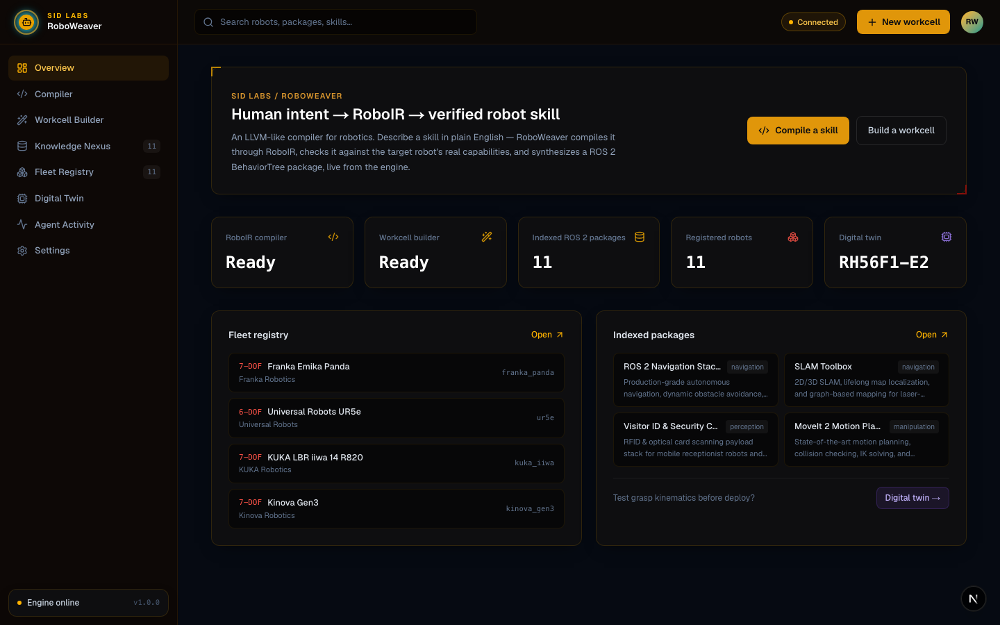
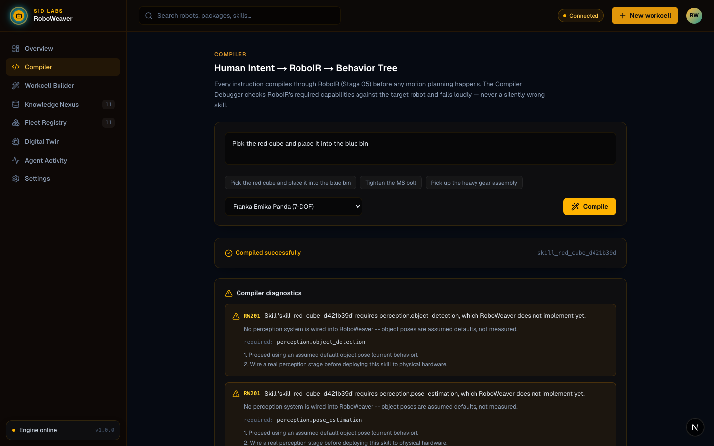
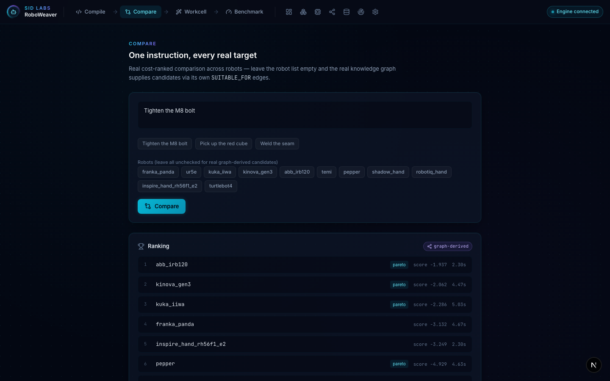
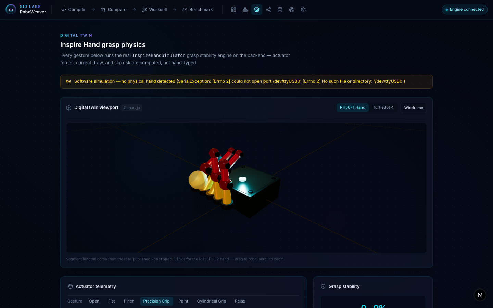
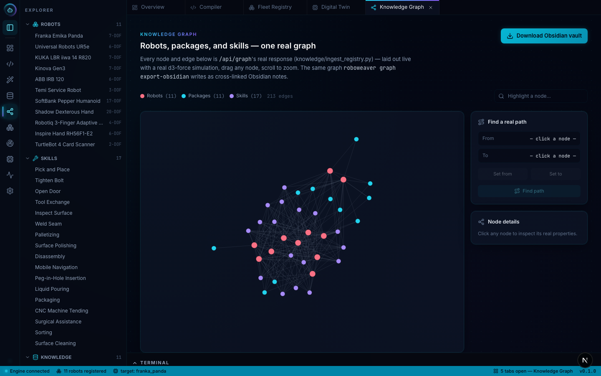
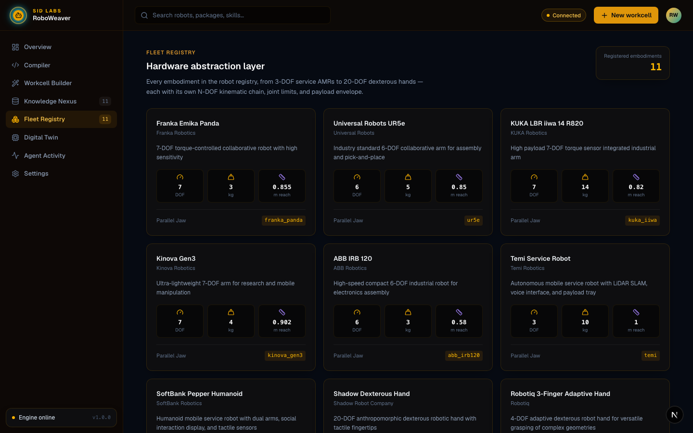
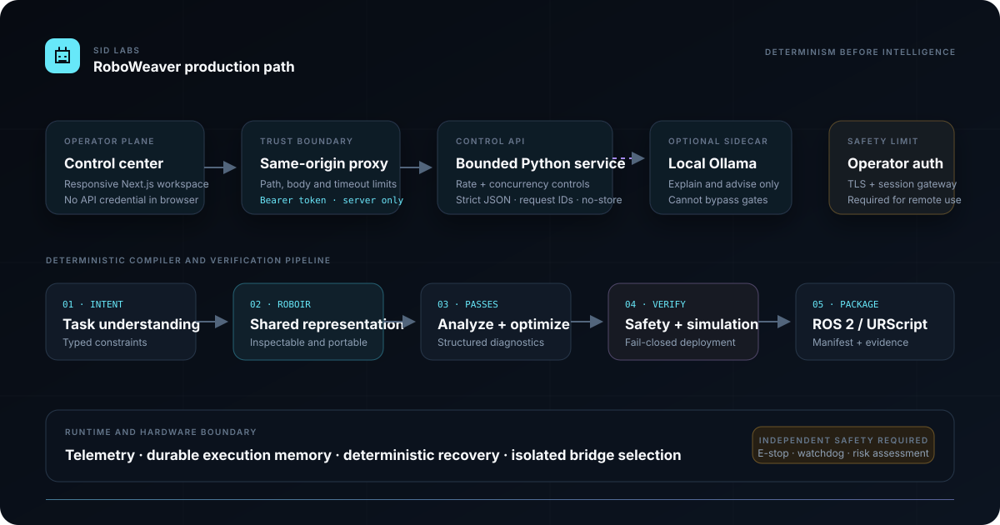
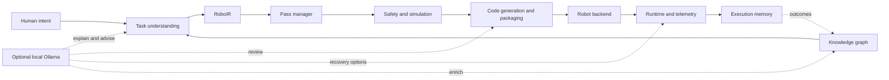

# RoboWeaver

[](https://github.com/Siddharthpatni/Roboweaver/actions/workflows/ci.yml)

**A compiler infrastructure for turning human intent into inspectable, verified robot skills.**

```text
LLVM:       source code  -> LLVM IR -> machine code
RoboWeaver: human intent -> RoboIR  -> robot skill
```

RoboWeaver gives task understanding, motion planning, safety analysis, simulation,
code generation, deployment, and recovery one shared intermediate representation:
**RoboIR**. The compiler is deterministic by default. A local Ollama co-pilot can
explain results, propose compositions and recovery options, and review generated code,
but it cannot bypass diagnostics, verification, or deployment gates.

> RoboWeaver is research and simulation software. It is not a certified robot safety
> controller; read the [production and physical-robot gate](docs/PRODUCTION.md) before
> connecting hardware.

[Architecture](docs/ARCHITECTURE.md) · [Roadmap](docs/ROADMAP.md) ·
[Research positioning](docs/RESEARCH.md) · [Benchmarks](docs/BENCHMARKS.md) ·
[Production](docs/PRODUCTION.md) · [Security](SECURITY.md) ·
[Contributing and AI-assistance policy](CONTRIBUTING.md) ·
[Compiler change log](docs/COMPILER_ROADMAP.md)

## See the system

These are real captures of the Next.js dashboard running against the Python backend,
not design mockups. They were recorded on 2026-08-04/05 and predate the current
sidebar/provider redesign; current 13-inch and 32-inch viewport acceptance evidence is
still tracked explicitly in `MILESTONES.md`.

[](docs/media/overview.png)

| Compile and inspect | Compare robot targets |
|---|---|
| [](docs/media/compiler.png) | [](docs/media/compare.png) |
| **Simulate the embodiment** | **Explore the knowledge graph** |
| [](docs/media/digital-twin.png) | [](docs/media/knowledge-graph.png) |
| **Browse registered hardware** | **Watch the end-to-end flow** |
| [](docs/media/fleet-registry.png) | [](docs/media/demo.gif) |

## Why a compiler?

“Pick up the red cube” sounds simple. Executing it safely requires a target robot,
capability checks, a task graph, kinematics, trajectories, safety constraints,
simulation evidence, controller-specific output, and observable runtime behavior.
Without a shared representation, each layer quietly makes its own assumptions.

RoboWeaver makes those assumptions explicit. Every compiler stage consumes typed data
and produces an inspectable result. Missing capabilities and unsafe plans become
structured diagnostics instead of late runtime surprises.

```text
Error RW102: Cannot compile skill 'skill_m8_bolt_407db03cd329' for backend 'temi'.
  Reason: RoboIR requires sensing.force_torque; Temi does not declare it.
  Fixes:  attach and register the sensor, or select a compatible controller.
```

The target-independent `ProgramSpec` is parsed once and lowered independently into a
complete RoboIR for each robot. ROS 2 and URScript backends consume only that verified
IR; changing the legacy `CompiledSkill` afterward cannot change generated output.

## What works today

| Area | Current implementation |
|---|---|
| Compiler | Typed RoboIR, full-conversion rewrite patterns, LLVM-style cached analyses with preservation/invalidation, timed pass traces, optional native `mlir-opt`, and RW1xx–RW7xx diagnostics |
| Robots | Registry-backed profiles, explicit motion-model contracts, serial arms, holonomic/differential bases, branched humanoids, multi-finger hands, URDF/STL export, discovery, and protocol-specific bridge selection |
| Planning | Deterministic routing for 18 NL actions across 17 categories, fail-closed unknown actions, typed observations, target-legality conversion, reproducible IK/posture/base lowering, optional scene collision replanning, and one-source/many-target compilation |
| Verification | IR structural invariants, capability checks, workspace/floor/joint/velocity constraints, bounded forbidden-zone checking, truthful process-model status, and fail-closed deployment |
| Code generation | RoboIR-only ROS 2 packages with exact target joints/waypoints, BehaviorTree.CPP/Groot2 XML, UR-only URScript, deployment manifests, and `.rwsp` archives |
| Runtime | Native simulation, optional MuJoCo, telemetry, execution memory, deterministic recovery, and opt-in AI recovery advice |
| Knowledge | A registry-ingested robotics graph, path queries, package recommendations, interactive visualization, and Obsidian export |
| Local AI | Ollama health and model discovery, parsing, explanations, diff summaries, composition, recovery advice, graph enrichment, chat, and code-review sidecars |
| Research lab | Bounded Ollama/Gemini/OpenRouter cascade, prompt-free traces, exact cache, connected-tree embodiment schema, deterministic URDF/training artifacts, hardened no-network sandbox, and six-metric evaluation |
| Interface | CLI plus a fluid localhost/LAN dashboard with compiler, evidence ledger, comparison, workcell, benchmark, research lab, fleet, digital-twin, graph, and AI co-pilot views |
| Operations | Private authenticated backend, compiler-only LAN gateway, Host/Origin validation, hardened containers, native MLIR acceptance, and dependency/build checks in CI |

The honest gaps still matter: default scenes use explicitly labelled assumed poses,
the perception layer validates external observations but does not bundle a camera
detector, collision planning is bounded sampled geometry rather than continuous or
self-collision proof, orientation/dynamics planning remains incomplete, only PICK has a native
process-outcome model, physical hardware-in-the-loop evidence is not part of CI, and
verification is not certification-grade. The maintained list is in the
[live milestones and future plan](MILESTONES.md); the shorter maintained roadmap is
also available in [docs/ROADMAP.md](docs/ROADMAP.md).

## Architecture

[](docs/media/system-architecture.svg)



RoboIR is the verification, code-generation, simulation, and deployment fixed point:
those stages never reinterpret the original sentence or mutable `CompiledSkill`.
Robot integrations sit behind a registry-based backend interface, so a new backend
does not require a parallel compiler. The AI layer is deliberately a sidecar. If
Ollama is stopped or a model fails, the deterministic pipeline still works.

## Install

RoboWeaver supports Python 3.10–3.12. The dashboard uses Node.js 22.

```bash
git clone https://github.com/Siddharthpatni/Roboweaver.git
cd Roboweaver
python -m pip install -e .
```

Add `.[sim]` for MuJoCo support or `.[test]` for the development test tools.

Start the API and dashboard in separate terminals:

```bash
roboweaver dashboard --port 8080
```

```bash
cd frontend
npm ci
npm run dev
```

Open [http://localhost:3000](http://localhost:3000). The API binds to
`127.0.0.1:8080` by default.

### Share the compiler on your local network

Keep the API private and expose only the token-holding frontend gateway:

```bash
cp .env.example .env
# Replace ROBOWEAVER_API_TOKEN in .env with a random value, then set:
# ROBOWEAVER_FRONTEND_BIND=0.0.0.0
# ROBOWEAVER_LAN_MODE=1
docker compose up --build
```

Other devices can open `http://<this-computer-private-ip>:3000`. Compiler, target
comparison, inspection, and artifact routes work without exposing the backend token.
Robot discovery/connection, model changes, AI calls, simulator mutation, and physical
control are blocked in LAN mode by default. `ROBOWEAVER_LAN_ALLOW_CONTROL=1` is a
separate deliberate opt-in and still enforces same-origin requests. Local mode also
requires same-origin browser evidence for every non-compiler route, preventing the
server-side token from becoming a CSRF bypass. Host validation accepts private IPs;
add exact DNS names to `ROBOWEAVER_LAN_ALLOWED_HOSTS` when needed. Requests arriving
through a private non-loopback IP or configured public bind are automatically treated
as LAN mode even if the explicit mode flag was accidentally omitted.

### Native LLVM/MLIR verification

RoboWeaver always runs its own full-conversion engine. With `mlir-opt` installed,
`ROBOWEAVER_MLIR_MODE=auto` also emits a module containing generic unregistered
`roboweaver.*` MLIR operations and executes
upstream `canonicalize` and `cse`, recording tool version and input/output SHA-256
digests. Set `ROBOWEAVER_MLIR_MODE=required` to fail compilation when native evidence
cannot be produced. CI installs `mlir-18-tools` and requires this path to succeed.

This is a real `mlir-opt` integration, not a claim that RoboWeaver links all LLVM
libraries or produces CPU machine code. RoboticsLanguage is not vendored; RoboWeaver
adapts its Input/Transformation/Output plugin composition model into a typed,
entry-point-discoverable compiler registry. Exact boundaries are maintained in
[MILESTONES.md](MILESTONES.md).

Upstream design/runtime references: [LLVM project](https://github.com/llvm/llvm-project),
[MLIR dialect conversion](https://mlir.llvm.org/docs/DialectConversion/),
[LLVM new pass manager](https://llvm.org/docs/NewPassManager.html), and
[RoboticsLanguage](https://github.com/robotcaresystems/RoboticsLanguage).

### Isolated research experiments

The Research Lab accepts open-ended embodiment prompts such as “design a climbing
monkey robot.” AI may propose only a bounded JSON morphology; RoboWeaver validates the
tree, limits, geometry, sensors, and training contract, then emits the URDF and Python
adapter scaffold deterministically. Model-authored source is never executed.

The provider cascade tries local Ollama first, then configured Gemini and OpenRouter
providers, with at most three total attempts. Optional keys stay in the backend:

```bash
# .env (all optional)
GEMINI_API_KEY=...
ROBOWEAVER_GEMINI_MODEL=gemini-3.5-flash-lite
OPENROUTER_API_KEY=...
```

Run the fixed sandbox validator and the reproducible compiler benchmark with:

```bash
docker compose --profile research run --rm experiment-sandbox
python scripts/run_research_evaluation.py --output research-results/evaluation.json
```

The sandbox has no network or devices, a read-only root, dropped capabilities, and
resource limits. It validates artifacts; it does not claim physics, policy training, or
physical readiness until a simulator adapter supplies that evidence. CI separately
configures a ROS 2 Jazzy/Gazebo Harmonic headless URDF spawn-and-inspect gate.

## Try the compiler

```bash
# Inspect available embodiments
roboweaver robots

# Compile and show every pass
roboweaver compile "Pick up the red cube" \
  --robot franka_panda --explain-passes

# Let the knowledge graph choose candidates, or name them explicitly
roboweaver compare "Tighten the M8 bolt"
roboweaver compare "Pick up the red cube" \
  --robots franka_panda,ur5e,kuka_iiwa

# Inspect and export the robotics graph
roboweaver graph build --json
roboweaver graph path skill_tighten_bolt package_nav2_bringup
roboweaver graph export-obsidian ./my-obsidian-vault

# Exercise the measured compiler pipeline
roboweaver benchmark
```

Try a deliberate capability failure as well:

```bash
roboweaver compile "Tighten the bolt" --robot temi
```

Temi is a mobile base without the manipulation and force/torque capabilities the task
requires, so compilation stops with a structured diagnostic.

## Add an optional AI co-pilot

Ollama is the default AI provider and stays on infrastructure you control. Pull a
model, start the server, and launch RoboWeaver normally:

```bash
ollama pull llama3.1:8b
ollama serve
```

```bash
export OLLAMA_HOST=http://localhost:11434
export ROBOWEAVER_MODEL_DEFAULT=llama3.1:8b
roboweaver dashboard --port 8080
```

The dashboard discovers installed models and lets you select one. Per-feature model
overrides are available in [`.env.example`](.env.example), so a code-focused model can
review generated output while a smaller model handles parsing or chat.

OpenRouter is an explicit remote option for endpoint identification and connection-code
review. Put the key in the ignored local `.env` file—never in frontend code or a query
parameter—and restart the containers:

```bash
OPENROUTER_API_KEY=sk-or-v1-your-key
ROBOWEAVER_OPENROUTER_MODEL=openrouter/free
ROBOWEAVER_OPENROUTER_MODEL_CODEGEN=cohere/north-mini-code:free
```

`openrouter/free` lets OpenRouter select from its currently available free models. Free
model availability, latency, and rate limits can change, and the response records the
actual model used. Connection review prefers the free, code-focused North Mini Code
model and supplies `openrouter/free` as an availability fallback; the deterministic
adapter remains usable if both fail. Selecting OpenRouter for endpoint identification sends the observed
host, port, banner, hostname, type guess, and latency to OpenRouter; the UI displays this
privacy boundary before the request. Connection-code review does not send the endpoint
URI.

The Connect Hardware view generates a deterministic, downloadable Python connection
adapter from the validated robot profile and bridge protocol. The adapter reads its
target from `ROBOWEAVER_TARGET_URI`, verifies connectivity, sends no trajectory, and
keeps any Ollama/OpenRouter annotation separate from the authoritative source.

AI output is treated as untrusted advice:

- explanations summarize an already completed deterministic compile;
- composed workcells must compile through the normal RoboIR pipeline;
- recovery suggestions do not replace deterministic recovery policy;
- graph suggestions are returned separately and are not silently committed; and
- code review writes an annotated candidate and JSON report beside the untouched,
  deterministic generated file;
- connection adapters are deterministic, no-motion probes and model reviews cannot
  replace their validated source.

## Run with containers

```bash
cp .env.example .env
# Replace the placeholder ROBOWEAVER_API_TOKEN in .env.
docker compose up --build
```

Both services publish on loopback only. The containers run as non-root users with
read-only filesystems, dropped Linux capabilities, `no-new-privileges`, and bounded
temporary storage. Hardware devices and ROS/DDS host networking are intentionally not
granted by the default Compose stack. See [production operations](docs/PRODUCTION.md)
before changing that boundary.

## Tests and release checks

The repository currently collects **420 tests across 53 test files**. Coverage spans
the compiler and pass manager, diagnostics, planning, code generators, knowledge graph,
simulation, safety and formal verification, recovery, hardware protocols, dashboard
hardening, and every optional Ollama integration with deterministic fakes.

```bash
python -m pytest tests/ -q
python -m pytest tests/ -q --cov=roboweaver --cov-branch --cov-fail-under=75
python -m ruff check src tests scripts
python -m build --no-isolation

cd frontend
npm run lint
npm run typecheck
npm run build
```

CI installs an exact test-toolchain lock, runs the Python suite on 3.10 and 3.12,
enforces a 75% branch-coverage floor and Ruff/Pyflakes, audits Python and npm
dependencies, runs Bandit and scheduled CodeQL analysis, wheel-builds generated ROS 2
packages, builds one generated package with ROS 2 Humble `colcon`, builds and installs
the project distribution, checks the frontend with Node.js 22, and smoke-tests the
authenticated container stack.

## Security model

Local development is tokenless because the API listens only on `127.0.0.1`. Binding to
a non-loopback address requires `ROBOWEAVER_API_TOKEN`. Requests are checked against an
exact Origin allow-list, control operations use bounded JSON `POST` bodies, bearer
tokens use constant-time comparison, and query sizes are capped.

The Python dashboard uses the standard-library HTTP server and is not a direct
internet-facing edge server. Keep it on loopback or an internal container network and
put TLS, operator authentication, session expiry, and request filtering at a mature
reverse proxy. Those controls protect the application boundary; they do not make
physical motion safe. Independent emergency stops, watchdogs, collision models,
measured joint-state feedback, controller acknowledgements, validated limits,
hardware-in-the-loop tests, and a robot-specific risk assessment remain mandatory.

## License

Apache License 2.0. See [LICENSE](LICENSE).
