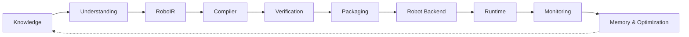
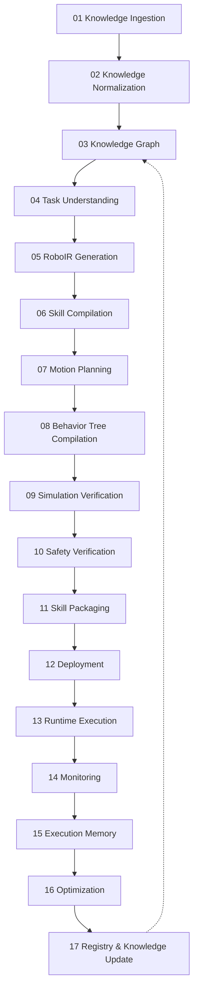

# RoboWeaver

**An LLVM-like compiler infrastructure for robotics that transforms human intent and
robotics knowledge into verified, executable robot skills.**

```
LLVM:      Source Code  →  LLVM IR  →  Machine Code (x86 / ARM / RISC-V)
RoboWeaver: Human Intent →  RoboIR   →  Robot Skill (Franka / UR / Pepper / … via a Robot Backend)
```

Full architecture rationale, the complete stage-by-stage audit of what's real versus
roadmap, and the reasoning behind every structural decision: [`docs/REDESIGN.md`](docs/REDESIGN.md).

---

## Demo

The dashboard below is the real Next.js frontend talking to the real Python backend
(`roboweaver dashboard`) — every screenshot and the recording underneath it come from
the app actually running, not mockups.


| Compiler + Debugger | Digital Twin | Fleet Registry |
|---|---|---|
| [](docs/media/compiler.png) | [](docs/media/digital-twin.png) | [](docs/media/fleet-registry.png) |

Run it yourself: §11 (Installation) below, or jump straight to §12 (Quick Start).

---

## 1. Introduction

Turning "pick the red cube and place it in the box" into a robot doing that correctly
requires task understanding, motion planning, safety checking, code generation for a
specific middleware, and execution. Most robotics projects rebuild this chain by hand,
per robot, per skill, with no shared representation a planner, a simulator, and a code
generator can all agree on. RoboWeaver is that shared representation — **RoboIR** — and
the compiler pipeline built around it.

## 2. Vision

One pipeline, one intermediate representation, each stage a strict transformation of
the previous stage's typed output. A skill compiled by RoboWeaver is inspectable at
every stage: what was understood from the instruction, what RoboIR was generated, what
motion was planned, what was verified in simulation, what gets packaged and deployed —
and, eventually, what was learned from running it. Nothing in the project exists unless
it implements a pipeline stage, is data a stage reads, or is a way for a human to drive
the pipeline.

## 3. Engineering Philosophy

- **One core, not ten projects.** Every module names the stage it belongs to.
- **State what's real. Never round up.** "Stage 15 does not exist yet" is worth more to
  a robotics engineer's trust than "autonomous memory engine continuously evolves
  skills" describing code that isn't there.
- **No stage silently swallows a failure.** A failed simulation, a safety violation, or
  a missing required capability (§6) stops the pipeline with a structured diagnostic —
  never a logged warning that compilation proceeds past anyway.
- **Determinism before intelligence.** Task Understanding is a deterministic parser
  today, not an LLM. An LLM-backed backend is additive roadmap, never a silent
  replacement for the reproducible default.
- **Prove it on one robot before claiming a fleet.** Multi-robot choreography is real
  and works, and it's Phase 3 (§10) — not the headline, until the single-robot core has
  proven itself.

## 4. System Architecture



RoboIR is the fixed point every later stage reads: Compiler, Verification, and
Packaging never see the raw parsed instruction, only the IR. Robot Backend is a
declared interface (§5) — every backend implemented today happens to target `rclpy`,
but the interface doesn't assume ROS 2.

## 5. Robot Backends, Not "ROS 2 Generation"

```
                              RoboIR
                                 │
                    ┌────────────┴────────────┐
                    │      Robot Backend        │
                    └────────────┬────────────┘
              ┌──────────────────┼──────────────────┐
              ▼                  ▼                  ▼
       Franka Backend      UR Backend         Pepper Backend
```

Today's compiler is already data-driven off a declarative `RobotSpec` rather than
per-robot code paths — that part of the design was already right. What's new is making
the backend boundary an explicit interface so a non-ROS 2 backend can be added later
without touching the compiler, verification, or packaging stages. Full detail:
[`docs/REDESIGN.md` §4](docs/REDESIGN.md#4-robot-backends--stop-overfocusing-on-ros-2).

## 6. RoboIR

```yaml
skill:
  id: skill_pick_red_cube_v1
intent:
  action: grasp
  object: { type: cube, color: red, role: source }
  destination: { type: bin, color: blue, role: destination }
constraints:
  payload_kg: 2.0
  precision_mm: 1.0
required_capabilities:
  perception: [object_detection, pose_estimation]
  manipulation: [grasp_planning, inverse_kinematics]
execution:
  robot: { dof: 7 }
  planner: { type: damped_pseudoinverse_ik }
verification:
  collision_check: true
  simulation_required: true
```

`required_capabilities` is what makes the **Compiler Debugger** (§7) possible: a skill
that needs a capability the target robot backend doesn't declare fails at compile time
with a structured, fixable error — not a silent bad plan. Full schema:
[`docs/REDESIGN.md` §2](docs/REDESIGN.md#2-roboir).

## 7. Compiler Debugger

```
Error RW102: Cannot compile skill 'pick_and_place_v1' for backend 'ur5e_backend'.

  Reason:   RoboIR requires sensing.force_torque; the target backend does not
            declare a force/torque sensor.
  Required: sensing.force_torque
  Fixes:    1. Attach and register a force/torque sensor.
            2. Change execution.controller.type to "position".
            3. Select a different robot backend.
```

Compiler-grade diagnostics, not a stack trace. **Implemented** — `ir/diagnostics.py`.
Try it: `roboweaver compile "Tighten the bolt" --robot temi` raises exactly the RW102
diagnostic above, because Temi is a mobile base with no force/torque sensor
(`has_force_torque_sensor=False`, a real, honest correction to its `RobotSpec`, not a
demo fixture). Perception gaps (no perception system exists yet) surface as
non-blocking `RW201` warnings on every pick/place skill instead of a silently assumed
pose. Rendered live in the frontend's Compiler view.

## 8. Complete Pipeline (Research Vision)



Full per-stage real-vs-roadmap table: [`docs/REDESIGN.md` §3](docs/REDESIGN.md#3-full-stage-table).

## 9. MVP — Built

Nine stages, single robot, one real demo — not the seventeen-stage research vision
above. **All nine now have real, tested code** (RoboIR was the one genuinely new piece;
it's built):

```
01 Knowledge → 02 Task Understanding → 03 RoboIR → 04 Skill Compiler
→ 05 Motion Planner → 06 Behavior Tree → 07 Simulation → 08 Package → 09 Dashboard
```

**Demo, reproducible today:**

```bash
roboweaver compile "Pick the red cube and place it into the blue bin" --verbose
```

RoboIR → Behavior Tree → trajectory → native/MuJoCo simulation (with real telemetry
recording and failure recovery, now wired into the execution path) → `.rwsp` skill
package. Full account of exactly what was built, cited by file:
[`docs/REDESIGN.md` §11](docs/REDESIGN.md#11-what-actually-got-built-phase-1).

## 10. Roadmap

**Phase 1 (MVP, §9): done.** `TelemetryRecorder`/`RecoveryEngine` wired into
`SkillRuntime.execute()`, Task Understanding's compound-goal parsing fixed, the
skill-registry reload bug fixed — all tested in `tests/test_ir.py`.

1. **Phase 2 — Deployment & Runtime.** Job/event model, async API (FastAPI), `colcon`-build
   CI check for generated ROS 2 packages.
2. **Phase 3 — Multi-Robot Backend.** Re-promote `MultiRobotChoreographer` — real and
   working today — from supporting extension to demoed capability.
3. **Phase 4 — Execution Memory & Optimization.** Log persistence before parameter
   tuning; never called "learning" until it demonstrably is.

## 11. Installation

```bash
git clone https://github.com/Siddharthpatni/Roboweaver.git
cd Roboweaver
pip install -e .              # add ".[sim]" for the MuJoCo-backed simulator
```

```bash
cd frontend && npm install && npm run dev   # http://localhost:3000
```

## 12. Quick Start

```bash
roboweaver robots
roboweaver compile "Pick up the red cube" --robot franka_panda
roboweaver dashboard --port 8080
```

## 13. Runtime & Hardware Bridges

`ROS2HardwareBridge` and `SimulationHardwareBridge` genuinely attempt a live `rclpy`
connection or a live TCP reachability probe and truthfully report failure when nothing
answers — verified in `tests/test_universal_platform.py`. The Inspire Hand RS485 driver
implements a real CRC-16/MODBUS checksum and a real serial read/write round trip,
proven against a virtual pty loopback (`tests/test_inspire_hand_real_serial_protocol.py`)
— no physical hand required to verify the protocol. No physical robot or live ROS 2
graph has run against this repository's test suite.

## 14. Knowledge Graph & Skill Registry

`RoboticsKnowledgeGraph` is a real, generic, JSON-serializable property graph with a
small seeded demo dataset, plus a static 11-entry ROS 2 package catalog matched by
keyword — not retrieval-augmented generation. `SkillRepository` persists compiled
skills to disk; a fresh instance (simulating a process restart) now correctly
reconstructs the full compiled skill via `SkillPackage.from_dict()` instead of
discarding it — verified in `tests/test_ir.py`.

## 15. Testing

Eight test files cover the compiler, RoboIR/Compiler Debugger, multi-robot
choreography, N-DOF kinematics, ROS 2 code generation, and the Inspire Hand RS485 wire
protocol — including a CRC-16/MODBUS implementation checked against a published test
vector — all passing on Python 3.10 and
3.12 in CI (`.github/workflows/ci.yml`).

```bash
PYTHONPATH=src python3 tests/test_roboweaver.py
PYTHONPATH=src python3 tests/test_multi_robot_choreography.py
PYTHONPATH=src python3 tests/test_universal_platform.py
PYTHONPATH=src python3 tests/test_prompt_builder.py
PYTHONPATH=src python3 tests/test_inspire_hand_rs485.py
PYTHONPATH=src python3 tests/test_inspire_simulation.py
PYTHONPATH=src python3 tests/test_inspire_hand_real_serial_protocol.py
PYTHONPATH=src python3 tests/test_ir.py
```

## 16. Benchmarks

No formal benchmark suite exists yet — reporting one before it exists would violate §3.
Latency/throughput benchmarking is future work, not claimed here until measured.

## 17. Research Contributions

RoboIR as a versioned, embodiment-independent intermediate representation carrying
required capabilities and safety/verification state, not just geometry; a Robot Backend
interface that keeps the compiler proper independent of any one middleware; an
honesty-by-construction pattern for hardware bridges (attempt a real connection, report
a typed truthful status); a Compiler Debugger that turns capability mismatches into
structured, fixable diagnostics instead of silent failures.

## 18. Future Work

Deployment beyond a local file write; Execution Memory and Optimization as a real
tuning loop, sequenced strictly in that order; orientation-aware motion planning; real
perception feeding object poses; an LLM-backed Task Understanding backend, additive to
the deterministic default; re-promoting multi-robot choreography once the single-robot
core is proven. Multi-tenant auth, a skill marketplace, and mobile clients are
explicitly out of scope — see [`docs/REDESIGN.md` §9](docs/REDESIGN.md#9-roadmap).

---

## License

Apache License, Version 2.0. See `LICENSE`.
