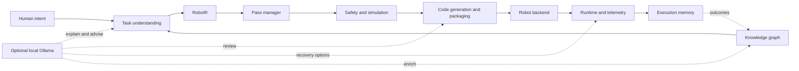

# RoboWeaver

**A compiler infrastructure for turning human intent into inspectable, verified robot skills.**

```text
LLVM:       source code  -> LLVM IR -> machine code
RoboWeaver: human intent -> RoboIR  -> robot skill
```

RoboWeaver gives task understanding, motion planning, safety analysis, simulation,
code generation, deployment, and recovery one shared intermediate representation:
**RoboIR**. The compiler is deterministic by default. A local Ollama co-pilot can
explain results, propose compositions and recovery options, and review generated code,
but it cannot bypass diagnostics, verification, or deployment gates.

> RoboWeaver is research and simulation software. It is not a certified robot safety
> controller; read the [production and physical-robot gate](docs/PRODUCTION.md) before
> connecting hardware.

[Architecture](docs/ARCHITECTURE.md) · [Roadmap](docs/ROADMAP.md) ·
[Research positioning](docs/RESEARCH.md) · [Benchmarks](docs/BENCHMARKS.md) ·
[Production](docs/PRODUCTION.md) · [Compiler change log](docs/COMPILER_ROADMAP.md)

## See the system

These are captures of the real Next.js dashboard running against the Python backend,
not design mockups.

[](docs/media/overview.png)

| Compile and inspect | Compare robot targets |
|---|---|
| [](docs/media/compiler.png) | [](docs/media/compare.png) |
| **Simulate the embodiment** | **Explore the knowledge graph** |
| [](docs/media/digital-twin.png) | [](docs/media/knowledge-graph.png) |
| **Browse registered hardware** | **Watch the end-to-end flow** |
| [](docs/media/fleet-registry.png) | [](docs/media/demo.gif) |

## Why a compiler?

“Pick up the red cube” sounds simple. Executing it safely requires a target robot,
capability checks, a task graph, kinematics, trajectories, safety constraints,
simulation evidence, controller-specific output, and observable runtime behavior.
Without a shared representation, each layer quietly makes its own assumptions.

RoboWeaver makes those assumptions explicit. Every compiler stage consumes typed data
and produces an inspectable result. Missing capabilities and unsafe plans become
structured diagnostics instead of late runtime surprises.

```text
Error RW102: Cannot compile skill 'pick_and_place_v1' for backend 'ur5e_backend'.
  Reason: RoboIR requires sensing.force_torque; the target does not declare it.
  Fixes:  attach and register the sensor, or select a compatible controller.
```

The same RoboIR can be analyzed, diffed across robot embodiments, simulated, packaged
for ROS 2 or URScript, and handed to a registered backend.

## What works today

| Area | Current implementation |
|---|---|
| Compiler | Typed RoboIR, an LLVM/MLIR-style pass manager, timed pass traces, static analysis, optimization, and RW1xx–RW6xx diagnostics |
| Robots | Registry-backed robot specifications, N-DOF kinematics, URDF/STL export, discovery, and protocol-specific bridge selection |
| Planning | Task routing for 17 natural-language skill categories, graph-derived robot candidates, trajectory planning, and cross-robot cost comparison |
| Verification | Capability checks, workspace and floor constraints, bounded formal verification, simulation validation, and fail-closed deployment |
| Code generation | Deterministic ROS 2 packages, BehaviorTree.CPP/Groot2 XML, URScript, deployment manifests, and `.rwsp` archives |
| Runtime | Native simulation, optional MuJoCo, telemetry, execution memory, deterministic recovery, and opt-in AI recovery advice |
| Knowledge | A registry-ingested robotics graph, path queries, package recommendations, interactive visualization, and Obsidian export |
| Local AI | Ollama health and model discovery, parsing, explanations, diff summaries, composition, recovery advice, graph enrichment, chat, and code-review sidecars |
| Interface | CLI plus a localhost-first dashboard with compiler, comparison, workcell, benchmark, fleet, digital-twin, graph, and AI co-pilot views |
| Operations | Backend and frontend containers, liveness/readiness probes, bearer protection for remote binds, Origin validation, and dependency/build checks in CI |

The honest gaps still matter: perception is not a production sensor pipeline, RoboIR
is not yet a general computational graph, motion planning needs deeper
collision-aware algorithms, multi-robot scheduling is limited, and verification is
not research- or certification-grade. The maintained list is in the
[roadmap](docs/ROADMAP.md).

## Architecture



RoboIR is the fixed point: later stages do not reinterpret the original sentence.
Robot integrations sit behind a registry-based backend interface, so a new backend
does not require a parallel compiler. The AI layer is deliberately a sidecar. If
Ollama is stopped or a model fails, the deterministic pipeline still works.

## Install

RoboWeaver supports Python 3.10–3.12. The dashboard uses Node.js 22.

```bash
git clone https://github.com/Siddharthpatni/Roboweaver.git
cd Roboweaver
python -m pip install -e .
```

Add `.[sim]` for MuJoCo support or `.[test]` for the development test tools.

Start the API and dashboard in separate terminals:

```bash
roboweaver dashboard --port 8080
```

```bash
cd frontend
npm ci
npm run dev
```

Open [http://localhost:3000](http://localhost:3000). The API binds to
`127.0.0.1:8080` by default.

## Try the compiler

```bash
# Inspect available embodiments
roboweaver robots

# Compile and show every pass
roboweaver compile "Pick up the red cube" \
  --robot franka_panda --explain-passes

# Let the knowledge graph choose candidates, or name them explicitly
roboweaver compare "Tighten the M8 bolt"
roboweaver compare "Pick up the red cube" \
  --robots franka_panda,ur5e,kuka_iiwa

# Inspect and export the robotics graph
roboweaver graph build --json
roboweaver graph path skill_tighten_bolt package_nav2_bringup
roboweaver graph export-obsidian ./my-obsidian-vault

# Exercise the measured compiler pipeline
roboweaver benchmark
```

Try a deliberate capability failure as well:

```bash
roboweaver compile "Tighten the bolt" --robot temi
```

Temi is a mobile base without the manipulation and force/torque capabilities the task
requires, so compilation stops with a structured diagnostic.

## Add the local Ollama co-pilot

Ollama is optional and stays on infrastructure you control. Pull a model, start the
server, and launch RoboWeaver normally:

```bash
ollama pull llama3.1:8b
ollama serve
```

```bash
export OLLAMA_HOST=http://localhost:11434
export ROBOWEAVER_MODEL_DEFAULT=llama3.1:8b
roboweaver dashboard --port 8080
```

The dashboard discovers installed models and lets you select one. Per-feature model
overrides are available in [`.env.example`](.env.example), so a code-focused model can
review generated output while a smaller model handles parsing or chat.

AI output is treated as untrusted advice:

- explanations summarize an already completed deterministic compile;
- composed workcells must compile through the normal RoboIR pipeline;
- recovery suggestions do not replace deterministic recovery policy;
- graph suggestions are returned separately and are not silently committed; and
- code review writes an annotated candidate and JSON report beside the untouched,
  deterministic generated file.

## Run with containers

```bash
cp .env.example .env
# Replace the placeholder ROBOWEAVER_API_TOKEN in .env.
docker compose up --build
```

Both services publish on loopback only. The containers run as non-root users with
read-only filesystems, dropped Linux capabilities, `no-new-privileges`, and bounded
temporary storage. Hardware devices and ROS/DDS host networking are intentionally not
granted by the default Compose stack. See [production operations](docs/PRODUCTION.md)
before changing that boundary.

## Tests and release checks

The repository currently collects **320 tests across 44 test files**. Coverage spans
the compiler and pass manager, diagnostics, planning, code generators, knowledge graph,
simulation, safety and formal verification, recovery, hardware protocols, dashboard
hardening, and every optional Ollama integration with deterministic fakes.

```bash
python -m pytest tests/ -q
python -m build

cd frontend
npm run lint
npx tsc --noEmit
npm run build
```

CI runs the Python suite on 3.10 and 3.12, verifies installed dependency consistency,
builds distributable artifacts, and checks the frontend with Node.js 22.

## Security model

Local development is tokenless because the API listens only on `127.0.0.1`. Binding to
a non-loopback address requires `ROBOWEAVER_API_TOKEN`. Requests are checked against an
exact Origin allow-list, control operations use bounded JSON `POST` bodies, bearer
tokens use constant-time comparison, and query sizes are capped.

Those controls protect the application boundary; they do not make physical motion
safe. Independent emergency stops, watchdogs, collision models, measured joint-state
feedback, controller acknowledgements, validated limits, hardware-in-the-loop tests,
and a robot-specific risk assessment remain mandatory.

## License

Apache License 2.0. See [LICENSE](LICENSE).
