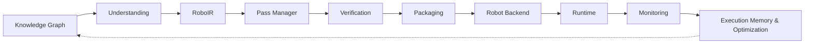

# RoboWeaver

**An LLVM-like compiler infrastructure for robotics that transforms human intent and
robotics knowledge into verified, executable robot skills.**

```
LLVM:      Source Code  →  LLVM IR  →  Machine Code (x86 / ARM / RISC-V)
RoboWeaver: Human Intent →  RoboIR   →  Robot Skill (Franka / UR / Pepper / … via a Robot Backend)
```

**Docs:** [Architecture](docs/ARCHITECTURE.md) · [Research Positioning](docs/RESEARCH.md) ·
[Roadmap](docs/ROADMAP.md) · [Benchmarks](docs/BENCHMARKS.md) ·
[Original Build Record](docs/REDESIGN.md) ·
[File-Cited Change Log](docs/COMPILER_ROADMAP.md)

---

## Demo

The dashboard below is the real Next.js frontend talking to the real Python backend
(`roboweaver dashboard`) — every screenshot and the recording underneath it come from
the app actually running, not mockups.


| Compiler + Debugger | Digital Twin (real three.js) | Knowledge Graph |
|---|---|---|
| [](docs/media/compiler.png) | [](docs/media/digital-twin.png) | [](docs/media/knowledge-graph.png) |

Run it yourself: [Installation](#installation) below, or jump to [Quick Start](#quick-start).

---

## Introduction

Turning "pick the red cube and place it in the box" into a robot doing that correctly
requires task understanding, motion planning, safety checking, code generation for a
specific middleware, and execution. Most robotics projects rebuild this chain by hand,
per robot, per skill, with no shared representation a planner, a simulator, and a code
generator can all agree on. RoboWeaver is that shared representation — **RoboIR** — and
the compiler pipeline built around it: a real pass manager, real static analysis and
optimization passes, a real plugin-based backend framework, and a real (bounded, scoped)
knowledge, memory, and verification layer around the core pipeline.

One pipeline, one intermediate representation, each stage a strict transformation of
the previous stage's typed output. A skill compiled by RoboWeaver is inspectable at
every stage: what was understood from the instruction, what RoboIR was generated, what
motion was planned, what was verified in simulation, what gets packaged and deployed —
and now, what real robots the knowledge graph considers candidates before any of that
even runs. Nothing in the project exists unless it implements a pipeline stage, is data
a stage reads, or is a way for a human to drive the pipeline.

## Engineering Philosophy

- **One core, not ten projects.** Every module names the stage it belongs to.
- **State what's real. Never round up.** "This mechanism exists but has zero
  accumulated data yet" is worth more to a robotics engineer's trust than "autonomous
  memory engine continuously evolves skills" describing code that isn't there.
- **No stage silently swallows a failure.** A failed simulation, a safety violation, or
  a missing required capability stops the pipeline with a structured diagnostic — never
  a logged warning that compilation proceeds past anyway.
- **Determinism before intelligence.** Task Understanding is a deterministic parser
  today, not an LLM. An LLM-backed backend (the connection advisor) is additive and
  explicitly optional, never a silent replacement for the reproducible default.
- **Every "done" claim is cited by file, and usually by test.** This isn't a slogan —
  every phase in `docs/COMPILER_ROADMAP.md` names the exact module and test file, and
  says what's still deferred and why, rather than letting a partial implementation read
  as complete.

## Architecture at a Glance



RoboIR is the fixed point every later stage reads. Robot Backend is a real,
registry-based interface (`Ros2Backend`, `UrScriptBackend`, register your own). The
Knowledge Graph is a real input to compilation now, not just an export target — full
detail, including what's honestly still a metadata pipeline rather than a computational
graph, in [`docs/ARCHITECTURE.md`](docs/ARCHITECTURE.md).

**RoboIR**, condensed:

```yaml
skill:
  id: skill_pick_red_cube_v1
intent:
  action: grasp
  object: { type: cube, color: red, role: source }
required_capabilities:
  perception: [object_detection, pose_estimation]
  manipulation: [grasp_planning, inverse_kinematics]
capability_claims: # real confidence + provenance, grounded in the target RobotSpec
  - { name: sensing.force_torque, confidence: 1.0, verified: true, source: robot_spec }
```

**Compiler Debugger**, condensed:

```
Error RW102: Cannot compile skill 'pick_and_place_v1' for backend 'ur5e_backend'.
  Reason:   RoboIR requires sensing.force_torque; the target backend does not
            declare a force/torque sensor.
  Fixes:    1. Attach and register a force/torque sensor.
            2. Change execution.controller.type to "position".
```

A skill that needs a capability the target robot doesn't declare fails at compile time
with a structured, fixable error — not a silent bad plan. Try it:
`roboweaver compile "Tighten the bolt" --robot temi` raises exactly this, because Temi
is a mobile base with no force/torque sensor. Full schema, the RW1xx–RW6xx diagnostic
taxonomy, and the real per-pass `--explain-passes` trace: [`docs/ARCHITECTURE.md`](docs/ARCHITECTURE.md).

## What's Real Today

A real Pass Manager (LLVM/MLIR-style, per-pass timed, full inspectable trace); real
static analysis and optimization passes; a real plugin/backend framework; a real
digital twin interface; real execution memory and case-based recovery; a real
multi-objective cost model that the knowledge graph now feeds candidates into; a real
safety kernel and bounded formal verification; RoboBench (a real compile-pipeline
benchmark); a real, generalized motion planner reaching all 17 NL-routable skill
categories; a real, registry-ingested knowledge graph with Obsidian export; a hardened,
localhost-only dashboard API; a VSCode-style IDE-shell frontend with a real three.js
digital twin.

Full list with file citations, plus what's genuinely still open and why (perception,
RoboIR-as-computational-graph, motion planning as a real pass, more genuine
optimization passes, multi-robot scheduling, research-grade verification):
[`docs/ROADMAP.md`](docs/ROADMAP.md).

## Installation

```bash
git clone https://github.com/Siddharthpatni/Roboweaver.git
cd Roboweaver
pip install -e .              # add ".[sim]" for the MuJoCo-backed simulator
```

```bash
cd frontend && npm install && npm run dev   # http://localhost:3000
```

## Quick Start

```bash
roboweaver robots
roboweaver compile "Pick up the red cube" --robot franka_panda --explain-passes
roboweaver compare "Tighten the M8 bolt"                      # knowledge-graph-derived candidates
roboweaver compare "Pick up the red cube" --robots franka_panda,ur5e,kuka_iiwa
roboweaver benchmark
roboweaver graph build --json
roboweaver graph path skill_tighten_bolt package_nav2_bringup
roboweaver graph export-obsidian ./my-obsidian-vault
roboweaver dashboard --port 8080      # binds 127.0.0.1 by default -- see Security below
```

## Testing

268 tests across 36 files cover the compiler pipeline, the Pass Manager, static
analysis and optimization passes, RoboIR/Compiler Debugger, multi-robot choreography,
N-DOF kinematics, ROS 2/URScript code generation, the plugin/backend framework, the
digital twin interface, execution memory and recovery planning, the cost model
(including graph-derived candidate selection), the safety kernel, formal verification,
RoboBench, the knowledge graph and Obsidian export, the dashboard's Origin/input-size
hardening, and the Inspire Hand RS485 wire protocol (including a CRC-16/MODBUS
implementation checked against a published test vector) — all passing on Python 3.10
and 3.12 in CI (`.github/workflows/ci.yml`).

```bash
python -m pytest tests/ -q
```

## Security & Local-Only by Design

The dashboard binds to `127.0.0.1` only by default (`roboweaver dashboard --host
0.0.0.0` is the explicit, warned-about opt-in for LAN access) and enforces an Origin
allow-list — any `http(s)://localhost|127.0.0.1|[::1]` port is accepted, anything else
gets a `403` before any handler runs. CORS headers alone don't stop a cross-origin
`fetch()` from firing (they only gate whether JS can *read* the response), so without
this check any webpage open in a user's browser could have silently triggered a real
side effect like `/api/connect`. Instruction/prompt query params are capped at 2000
characters and robot-list params at 20 entries. Verified in
`tests/test_dashboard_hardening.py` against a real, live-started server, not mocked.

---

## License

Apache License, Version 2.0. See `LICENSE`.
