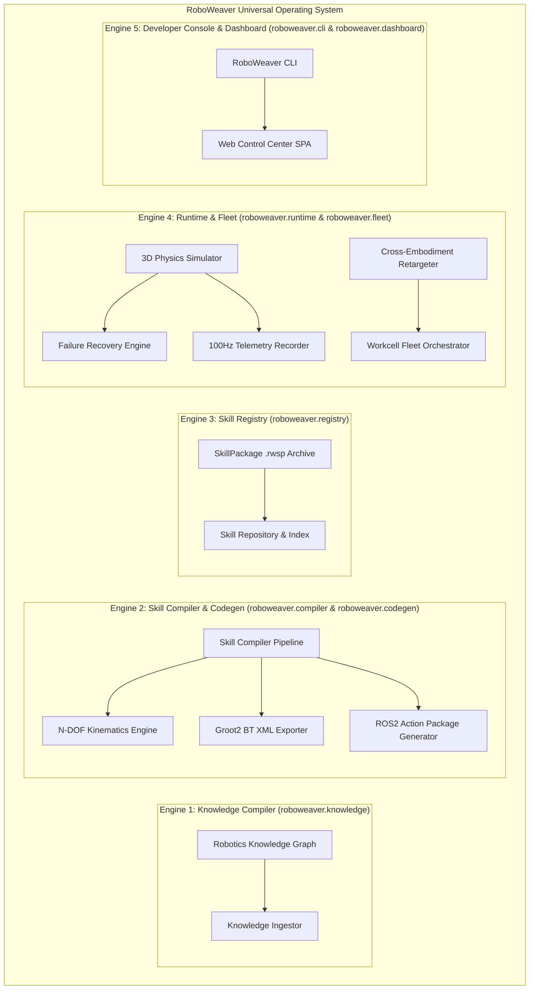

# RoboWeaver 🤖🧵

> **Tagline**: *"Compile Robotics Knowledge into Executable Intelligence for Every Robot."*

[](https://www.python.org/)
[](LICENSE)
[]()
[](https://docs.ros.org/)

RoboWeaver is a **Universal Robotics Skill Operating System** designed to automatically convert natural language human intent and robotics knowledge into executable, versioned, deployable robot capabilities (`.rwsp`) across heterogeneous industrial robot arms.

---

## 🔑 The Core Thesis

> **"Can a machine take human intent and convert it into an executable robot capability across any robot?"**

RoboWeaver proves this thesis by providing a **5-Engine Compilation & Runtime Pipeline**:
1. **Natural Language Intent Parsing** $\rightarrow$ High-level action, target object, physical parameters.
2. **Task Graph Decomposition** $\rightarrow$ Atomic perceive, approach, grasp, transfer, verify, and release steps.
3. **Generalized N-DOF Kinematics** $\rightarrow$ Analytical + Levenberg-Marquardt Damped Least-Squares 6-DOF & 7-DOF IK with sub-millimeter precision.
4. **Behavior Tree & ROS2 Code Generation** $\rightarrow$ Groot2 BehaviorTree.CPP v4 XML & runnable ROS2 `rclpy` Action packages.
5. **3D Physics Runtime & Fleet Deployment** $\rightarrow$ 100Hz real-time simulation, contact physics, telemetry logging, cross-embodiment retargeting, and multi-robot workcell orchestration.

---

## 🏗️ Architecture Overview



---

## 🤖 Supported Robot Arm Embodiments

RoboWeaver provides a **Universal Hardware Abstraction Layer (`roboweaver.hardware`)** supporting 6-DOF and 7-DOF industrial and collaborative arms:

| Robot Profile | DOF | Type | Max Reach | Payload | Driver / Interface |
| :--- | :---: | :---: | :---: | :---: | :--- |
| **Franka Emika Panda** | 7 | Collaborative | 855 mm | 3.0 kg | `franka_ros2` / FCI Torque |
| **Universal Robots UR5e** | 6 | Collaborative | 850 mm | 5.0 kg | `ur_robot_driver` / RTDE |
| **KUKA LBR iiwa 14** | 7 | Sensitive Industrial | 820 mm | 14.0 kg | `kuka_rsi` / FRI Torque |
| **Kinova Gen3** | 7 | Ultra-Lightweight | 902 mm | 4.0 kg | `kortex_ros2` |
| **ABB IRB 120** | 6 | Compact Industrial | 580 mm | 3.0 kg | `abb_ros2` / EGM |
| **Generic N-DOF Arm** | $N$ | Configurable | Custom | Custom | ROS2 Control (`hardware_interface`) |

---

## 🛠️ Industrial Skill Taxonomy

RoboWeaver includes pre-built task decomposers and behavior tree templates for 6 core industrial skill categories:

1. **`PICK_AND_PLACE`**: 3D approach, parallel jaw grasp, transfer trajectory, and precision release.
2. **`TIGHTEN_BOLT`**: Force/impedance controlled socket alignment, spiral search, and torque-limited tightening (25 Nm).
3. **`OPEN_DOOR`**: Handle detection, latch rotation (30 deg), circular arc trajectory, and compliance.
4. **`TOOL_EXCHANGE`**: Dock alignment, pneumatic tool coupler unlock/lock, and sensor re-zeroing.
5. **`INSPECT_SURFACE`**: 3D visual coverage path scanning with camera tilt/yaw alignment.
6. **`WELD_SEAM`**: Constant velocity arc welding seam trajectory with thermal constraints.

---

## 🚀 Quickstart & Usage

### 1. Installation

```bash
git clone https://github.com/Siddharthpatni/Roboweaver.git
cd Roboweaver
pip install -e .
```

### 2. List Supported Robot Embodiments

```bash
PYTHONPATH=src python3.11 -m roboweaver.cli.main robots
```

### 3. Compile Natural Language Instruction to Skill

```bash
# Compile Pick & Place for Franka Panda
PYTHONPATH=src python3.11 -m roboweaver.cli.main compile "Pick up the red cube" --robot panda

# Compile Torque Tightening for KUKA iiwa
PYTHONPATH=src python3.11 -m roboweaver.cli.main compile "Tighten M8 bolt" --robot kuka_iiwa
```

### 4. Execute Skill in 3D Physics Simulation

```bash
PYTHONPATH=src python3.11 -m roboweaver.cli.main execute "Pick up the red cube" --robot panda
```

### 5. Export Deployable ROS2 Action Package & `.rwsp` Archive

```bash
PYTHONPATH=src python3.11 -m roboweaver.cli.main export "Pick up the red cube" --output ./output
```

*Outputs*:
- Deployable ROS2 `rclpy` package: `output/roboweaver_pick_red_cube/` (`action_server.py`, `behavior_tree.xml`, `package.xml`, `setup.py`)
- Versioned Skill Archive: `output/skill_pick_red_cube_franka_panda.rwsp`

### 6. Retarget Skill Across Robot Embodiments (Franka Panda $\rightarrow$ UR5e)

```bash
PYTHONPATH=src python3.11 -m roboweaver.cli.main retarget "Pick up the red cube" --from panda --to ur5e
```

### 7. Deploy Skill Across Multi-Robot Workcell Fleet

```bash
PYTHONPATH=src python3.11 -m roboweaver.cli.main fleet "Pick up the red cube" --cell factory_cell_1
```

### 8. Launch Web Control Dashboard

```bash
PYTHONPATH=src python3.11 -m roboweaver.cli.main dashboard --port 8080
```
*Open your browser at `http://localhost:8080` to inspect the Knowledge Graph, compile skills live, and view Behavior Tree XML.*

---

## 🧪 Testing & Verification

RoboWeaver includes an automated test suite verifying all 5 engine subsystems:

```bash
PYTHONPATH=src python3.11 -m unittest discover -s tests
```

```text
Ran 6 tests in 0.743s
OK
```

---

## 📄 License

RoboWeaver is released under the [Apache 2.0 License](LICENSE).
