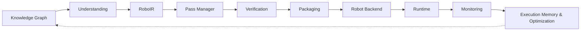
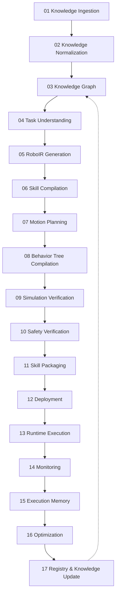

# RoboWeaver

**An LLVM-like compiler infrastructure for robotics that transforms human intent and
robotics knowledge into verified, executable robot skills.**

```
LLVM:      Source Code  →  LLVM IR  →  Machine Code (x86 / ARM / RISC-V)
RoboWeaver: Human Intent →  RoboIR   →  Robot Skill (Franka / UR / Pepper / … via a Robot Backend)
```

Full architecture rationale and the original stage-by-stage build record:
[`docs/REDESIGN.md`](docs/REDESIGN.md). Everything built since — a real pass manager,
static analysis and optimization passes, a plugin/backend framework, a digital twin
interface, execution memory and case-based recovery, a multi-objective cost model, a
safety kernel, bounded formal verification, a real compile-time benchmark suite, real
knowledge-graph ingestion with Obsidian export, and the VSCode-style frontend — is
tracked with the same discipline in [`docs/COMPILER_ROADMAP.md`](docs/COMPILER_ROADMAP.md),
the living source of truth for what's real versus deferred.

---

## Demo

The dashboard below is the real Next.js frontend talking to the real Python backend
(`roboweaver dashboard`) — every screenshot and the recording underneath it come from
the app actually running, not mockups.


| Compiler + Debugger | Digital Twin (real three.js) | Knowledge Graph |
|---|---|---|
| [](docs/media/compiler.png) | [](docs/media/digital-twin.png) | [](docs/media/knowledge-graph.png) |

Run it yourself: §11 (Installation) below, or jump straight to §12 (Quick Start).

---

## 1. Introduction

Turning "pick the red cube and place it in the box" into a robot doing that correctly
requires task understanding, motion planning, safety checking, code generation for a
specific middleware, and execution. Most robotics projects rebuild this chain by hand,
per robot, per skill, with no shared representation a planner, a simulator, and a code
generator can all agree on. RoboWeaver is that shared representation — **RoboIR** — and
the compiler pipeline built around it: a real pass manager, real static analysis and
optimization passes, a real plugin-based backend framework, and a real (bounded, scoped)
knowledge, memory, and verification layer around the core pipeline.

## 2. Vision

One pipeline, one intermediate representation, each stage a strict transformation of
the previous stage's typed output. A skill compiled by RoboWeaver is inspectable at
every stage: what was understood from the instruction, what RoboIR was generated, what
motion was planned, what was verified in simulation, what gets packaged and deployed —
and, now, what real execution history exists to learn from (currently none — the
mechanism is real, the accumulated data isn't, and that's stated plainly, not implied
away). Nothing in the project exists unless it implements a pipeline stage, is data a
stage reads, or is a way for a human to drive the pipeline.

## 3. Engineering Philosophy

- **One core, not ten projects.** Every module names the stage it belongs to.
- **State what's real. Never round up.** "This mechanism exists but has zero
  accumulated data yet" is worth more to a robotics engineer's trust than "autonomous
  memory engine continuously evolves skills" describing code that isn't there.
- **No stage silently swallows a failure.** A failed simulation, a safety violation, or
  a missing required capability (§6) stops the pipeline with a structured diagnostic —
  never a logged warning that compilation proceeds past anyway.
- **Determinism before intelligence.** Task Understanding is a deterministic parser
  today, not an LLM. An LLM-backed backend (the connection advisor, §13) is additive
  and explicitly optional, never a silent replacement for the reproducible default.
- **Every "done" claim is cited by file, and usually by test.** This isn't a slogan —
  every phase in `docs/COMPILER_ROADMAP.md` names the exact module and test file, and
  says what's still deferred and why, rather than letting a partial implementation read
  as complete.

## 4. System Architecture



RoboIR is the fixed point every later stage reads: the Pass Manager, Verification, and
Packaging never see the raw parsed instruction, only the IR — and now run through real,
timed, diagnostic-emitting compiler passes (§9) rather than a single opaque function
call. Robot Backend is a real, registry-based interface (§5) — every backend
implemented today happens to target `rclpy` or URScript, but the interface doesn't
assume either.

## 5. Robot Backends, Not "ROS 2 Generation"

```
                              RoboIR
                                 │
                    ┌────────────┴────────────┐
                    │   RobotBackend (real ABC) │
                    │   via a real PluginRegistry│
                    └────────────┬────────────┘
              ┌──────────────────┼──────────────────┐
              ▼                  ▼                  ▼
        Ros2Backend        UrScriptBackend      (register your own)
```

The compiler is data-driven off a declarative `RobotSpec` rather than per-robot code
paths. `plugins/registry.py::PluginRegistry` is a real, generic, name-keyed registry —
the same primitive backs robot-driver bridge dispatch, `RobotBackend`s, and
`DigitalTwin`s. `plugins/backend.py::RobotBackend` (`metadata()`, `capabilities()`,
`validate()`, `compile()`, `deploy()`) has two real implementations: `Ros2Backend`
(wraps the existing ROS 2 codegen) and `UrScriptBackend` (real, syntactically valid
URScript `movej()`/`sleep()`/`set_digital_out()` generated from the compiled skill's
real task graph). `deploy()` runs the real Safety Kernel (§9) and a real simulation
check before any bridge connect is attempted. Adding a new backend is a registry entry,
not a compiler change. Full detail: [`docs/REDESIGN.md` §4](docs/REDESIGN.md#4-robot-backends--stop-overfocusing-on-ros-2)
and [`docs/COMPILER_ROADMAP.md`](docs/COMPILER_ROADMAP.md) (v2 Vision, item 3).

## 6. RoboIR

```yaml
skill:
  id: skill_pick_red_cube_v1
intent:
  action: grasp
  object: { type: cube, color: red, role: source }
  destination: { type: bin, color: blue, role: destination }
constraints:
  payload_kg: 2.0
  precision_mm: 1.0
required_capabilities:
  perception: [object_detection, pose_estimation]
  manipulation: [grasp_planning, inverse_kinematics]
capability_claims: # real, per-capability confidence + provenance (v2 item 2)
  - { name: sensing.force_torque, confidence: 1.0, verified: true, source: robot_spec }
execution:
  robot: { dof: 7 }
  planner: { type: damped_pseudoinverse_ik }
verification:
  collision_check: true
  simulation_required: true
```

`required_capabilities` is what makes the **Compiler Debugger** (§7) possible: a skill
that needs a capability the target robot backend doesn't declare fails at compile time
with a structured, fixable error — not a silent bad plan. `capability_claims` (new)
carries real confidence/verified provenance per capability, grounded in the target
`RobotSpec`'s actual declared fields, not a guess. Full schema:
[`docs/REDESIGN.md` §2](docs/REDESIGN.md#2-roboir).

## 7. Compiler Debugger

```
Error RW102: Cannot compile skill 'pick_and_place_v1' for backend 'ur5e_backend'.

  Reason:   RoboIR requires sensing.force_torque; the target backend does not
            declare a force/torque sensor.
  Required: sensing.force_torque
  Fixes:    1. Attach and register a force/torque sensor.
            2. Change execution.controller.type to "position".
            3. Select a different robot backend.
```

Compiler-grade diagnostics, not a stack trace — now emitted by a real, ordered pass
pipeline (`ir/pass_manager.py` for RoboIR passes, `optimize/pass_manager.py` for
`CompiledSkill` passes) instead of one opaque function call, with real per-pass timing
and metrics and a `roboweaver compile --explain-passes` trace to inspect it. The
diagnostic taxonomy spans RW1xx (capability), RW2xx (perception), RW3xx (safety), RW4xx
(RoboIR structural), RW5xx (`CompiledSkill` structural/timing/BT well-formedness), and
RW6xx (multi-robot choreography DAG). Try it: `roboweaver compile "Tighten the bolt"
--robot temi` raises exactly the RW102 diagnostic above, because Temi is a mobile base
with no force/torque sensor (`has_force_torque_sensor=False`, a real field on its
`RobotSpec`). Perception gaps (no perception system exists yet) surface as
non-blocking `RW201` warnings instead of a silently assumed pose. Rendered live in the
frontend's Compiler view — auto-compiled on open, not an empty console waiting for
input.

## 8. Complete Pipeline (Research Vision)



More of this is real today than when this table was first written: Knowledge Ingestion
(03) is real registry ingestion, not a demo dataset; Execution Memory (15) and
Optimization (16) are real, tested mechanisms (§9); Monitoring (14) is real
`TelemetryRecorder`. Full per-stage real-vs-roadmap table, kept current:
[`docs/REDESIGN.md` §3](docs/REDESIGN.md#3-full-stage-table).

## 9. What's Real Today

**The MVP core (single robot, nine stages) — done:**

```
01 Knowledge → 02 Task Understanding → 03 RoboIR → 04 Skill Compiler
→ 05 Motion Planner → 06 Behavior Tree → 07 Simulation → 08 Package → 09 Dashboard
```

```bash
roboweaver compile "Pick the red cube and place it into the blue bin" --verbose
```

RoboIR → Behavior Tree → trajectory → native/MuJoCo simulation (real telemetry
recording and failure recovery) → `.rwsp` skill package. Full account, cited by file:
[`docs/REDESIGN.md` §11](docs/REDESIGN.md#11-what-actually-got-built-phase-1).

**Everything built on top of that core, tracked in full in
[`docs/COMPILER_ROADMAP.md`](docs/COMPILER_ROADMAP.md)** — every item below is real,
tested, and cited by file there; only the headline is repeated here:

- **A real Pass Manager** (`ir/pass_manager.py`, `optimize/pass_manager.py`) — LLVM/MLIR-
  style: an ordered list of passes over immutable, frozen (SSA-style) IR/skill
  generations, each pass timed by the manager itself (not self-reported), producing a
  full `PipelineTrace` inspectable via `roboweaver compile --explain-passes` or
  `/api/compile?explain_passes=1`.
- **Real static analysis and optimization passes** — `CompiledSkillVerificationPass`
  (RW501/RW502/RW505), choreography DAG checks (RW601–RW605, cycle detection, resource
  conflicts, dangling/unreachable handoffs), `WaypointDecimationPass` (up to ~83%
  trajectory compression, self-verified against the real velocity-limit safety check),
  `RedundantSegmentElisionPass`.
- **A real plugin/backend framework** (§5) — `PluginRegistry`, `RobotBackend` ABC,
  `Ros2Backend`/`UrScriptBackend`.
- **A real digital twin interface** — `DigitalTwin` ABC; `NativeTwin` wraps the real
  `SkillRuntime` (kinematics, grasp physics, telemetry); `RemoteTwin` is an honest
  TCP-reachability probe that explicitly reports "no real physics ran" rather than
  fabricating an Isaac/Gazebo/Webots result.
- **Real execution memory and case-based recovery** — `ExecutionMemoryStore` (opt-in,
  JSONL-persisted, `None` — never a fabricated `0.0` — when no history exists);
  `RecoveryEngine` scores declared-prior recovery candidates and boosts them with real
  historical success rates once real data accumulates.
- **A real multi-objective cost model** — `CompiledSkillCost` (cycle time, payload
  margin, joint travel, manipulability margin), a real Pareto-dominance filter, and
  `roboweaver compare INSTRUCTION --robots a,b,c` / `/api/compare`.
- **A real (mandatory, defense-in-depth) safety kernel** at the `RobotBackend.deploy()`
  boundary, and **real bounded formal verification** — BT well-formedness (RW506) and a
  declared-forbidden-joint-zone check (RW507) — explicitly not an SMT/temporal-logic
  proof, stated as such.
- **RoboBench** — a real compile-pipeline benchmark (latency, diagnostics, waypoint
  reduction) over every distinct registered robot × all 17 NL-reachable skill
  categories. `roboweaver benchmark` / `/api/benchmark`.
- **A real, generalized motion planner** — every `MOVE_TO` task in every skill category
  gets a real, IK-solved trajectory keyed by its own task description (previously only
  the pick/place category did; RW502 no longer fires anywhere).
- **All 17 industrial/service skill categories are NL-reachable** — PALLETIZING,
  POLISHING, DISASSEMBLY, and MOBILE_NAV were real templates with no route from natural
  language until this batch; now they are.
- **A real knowledge graph** (§14) — registry-ingested (not seeded demo data), real
  multi-hop BFS pathfinding, real Obsidian markdown export, and a real force-directed
  graph view in the frontend (§18).
- **A hardened, localhost-only dashboard API** (§19).
- **A VSCode/Antigravity-style IDE-shell frontend** (§18) with a real three.js digital
  twin, replacing an earlier canvas-2D sketch.

## 10. Roadmap

**Phases 1–4 of the original compiler roadmap, the full 14-item "v2 vision" batch, a
4-item gap-fix batch, real knowledge-graph ingestion, dashboard API hardening, and the
IDE-shell frontend rebuild are all done** — see §9 above for the headline list and
[`docs/COMPILER_ROADMAP.md`](docs/COMPILER_ROADMAP.md) for the file-cited detail on
every one of them, including what each deliberately still defers and why.

**Genuinely still open**, in the order it makes sense to tackle them:

1. **Perception.** No perception system exists; every object pose is a disclosed,
   assumed default (`RW201`). This is the single biggest gap standing between today's
   compiler and a skill that runs on a real, unstructured scene.
2. **Research-grade verification.** An SMT/temporal-logic proof of a continuous-time
   safety property — needs a solver dependency (e.g. `z3-solver`) not added here
   without a deliberate decision, and nonlinear real arithmetic over trigonometric
   forward kinematics. Today's formal verification (§9) is real but bounded/discrete.
3. **Live simulator integration.** `RemoteTwin` is the honest placeholder for
   Isaac/Gazebo/Webots — real when those engines are reachable, which they aren't in
   this environment.
4. **Profile-guided optimization and deterministic replay**, once real execution
   history (§9's execution memory) has actually accumulated from real usage — the
   mechanism exists, the data doesn't yet.
5. **An LLM-backed Task Understanding backend**, strictly additive to the deterministic
   default (§3), never a silent replacement for it.

Multi-tenant auth, a skill marketplace, and mobile clients remain explicitly out of
scope — see [`docs/REDESIGN.md` §9](docs/REDESIGN.md#9-roadmap).

## 11. Installation

```bash
git clone https://github.com/Siddharthpatni/Roboweaver.git
cd Roboweaver
pip install -e .              # add ".[sim]" for the MuJoCo-backed simulator
```

```bash
cd frontend && npm install && npm run dev   # http://localhost:3000
```

## 12. Quick Start

```bash
roboweaver robots
roboweaver compile "Pick up the red cube" --robot franka_panda --explain-passes
roboweaver compare "Pick up the red cube" --robots franka_panda,ur5e,kuka_iiwa
roboweaver benchmark
roboweaver graph build --json
roboweaver graph path skill_tighten_bolt package_nav2_bringup
roboweaver graph export-obsidian ./my-obsidian-vault
roboweaver dashboard --port 8080      # binds 127.0.0.1 by default -- see §19
```

## 13. Runtime & Hardware Bridges

`ROS2HardwareBridge` and `SimulationHardwareBridge` genuinely attempt a live `rclpy`
connection or a live TCP reachability probe and truthfully report failure when nothing
answers — verified in `tests/test_universal_platform.py`. The Inspire Hand RS485 driver
implements a real CRC-16/MODBUS checksum and a real serial read/write round trip,
proven against a virtual pty loopback (`tests/test_inspire_hand_real_serial_protocol.py`)
— no physical hand required to verify the protocol. The connection advisor (`roboweaver
advise`) is a real, optional LLM call (Ollama local/free by default, or
OpenRouter/Anthropic/OpenAI) that only ever *suggests* a robot id/protocol — the backend
validates it against the real registry, so a hallucinated id never reaches the UI as a
suggestion. No physical robot or live ROS 2 graph has run against this repository's
test suite.

## 14. Knowledge Graph & Skill Registry

`RoboticsKnowledgeGraph` is a real, generic, JSON-serializable property graph.
`knowledge/ingest_registry.py::build_graph_from_registry()` builds it from the live
registries, not seeded demo data: one `ROBOT` node per distinct `RobotSpec` in
`ROBOT_REGISTRY` (11), one `PACKAGE` node per `RoboticsPackageNexus.PACKAGE_CATALOG`
entry (11) with real `COMPATIBLE_WITH` edges to the robots its own `compatible_robots`
list actually names, one `SKILL` node per NL-reachable `IndustrialSkillCategory` (17)
with a `SUITABLE_FOR` edge gated on `has_force_torque_sensor` for skills that really
need it — 39 nodes, 213 edges, verified live. `find_path()` is a real BFS returning
`None` (never a fabricated route) when two nodes genuinely aren't connected within the
hop limit. `knowledge/obsidian_export.py::export_to_obsidian()` writes one real
markdown note per node with a properties table and `[[wikilink]]`-cross-linked outgoing
edges — every link resolves to a real file, opens as a connected graph in the actual
Obsidian app. Reachable from the CLI (`roboweaver graph build|path|export-obsidian`),
the dashboard API (`/api/graph`, `/api/graph/path`, `/api/graph/export-obsidian` —
streams the same vault as a one-click zip download), and the frontend (§18, a real
d3-force-laid-out graph view, not a static diagram).

`SkillRepository` persists compiled skills to disk; a fresh instance (simulating a
process restart) correctly reconstructs the full compiled skill via
`SkillPackage.from_dict()` — verified in `tests/test_ir.py`.

## 15. Testing

262 tests across 35 files cover the compiler pipeline, the Pass Manager, static
analysis and optimization passes, RoboIR/Compiler Debugger, multi-robot choreography,
N-DOF kinematics, ROS 2/URScript code generation, the plugin/backend framework, the
digital twin interface, execution memory and recovery planning, the cost model, the
safety kernel, formal verification, RoboBench, the knowledge graph and Obsidian export,
the dashboard's Origin/input-size hardening, and the Inspire Hand RS485 wire protocol
(including a CRC-16/MODBUS implementation checked against a published test vector) —
all passing on Python 3.10 and 3.12 in CI (`.github/workflows/ci.yml`).

```bash
python -m pytest tests/ -q
```

## 16. Benchmarks

**RoboBench** (`benchmark/robobench.py`) is a real compile-pipeline measurement —
latency, success/failure, diagnostic counts, waypoint reduction — over every distinct
registered robot × every skill category the compiler's NL pipeline can actually reach
(all 17). Explicitly scoped as compile-time measurement, not simulator-execution
benchmarking (no simulators are integrated here yet — stated in the report's own
`scope` field, never silently implied to be more).

```bash
roboweaver benchmark --output report.json
```

## 17. Research Contributions

RoboIR as a versioned, embodiment-independent intermediate representation carrying
required capabilities, provenance-tagged capability claims, and safety/verification
state, not just geometry; a real LLVM/MLIR-style pass manager over frozen, SSA-style IR
generations with per-pass timing and a full inspectable trace; a Robot Backend
interface, backed by a generic plugin registry, that keeps the compiler proper
independent of any one middleware; an honesty-by-construction pattern applied
consistently across hardware bridges, digital twins, execution memory, and case-based
recovery (attempt/measure the real thing, report a typed truthful status, `None` rather
than a fabricated number when there's no data); a Compiler Debugger that turns
capability mismatches into structured, fixable diagnostics instead of silent failures;
a real, registry-ingested knowledge graph with multi-hop pathfinding and a genuine
Obsidian export.

## 18. Frontend — IDE Shell, Not a Nav Menu

Restructured around a VSCode/Antigravity-style shell: an icon-only Activity Bar, a
real-data Explorer tree (robots/skills/knowledge/discovered endpoints, all fetched live,
none hardcoded), a closable multi-tab strip, a Terminal panel, and a Status Bar.

The **Terminal panel** is a live structured-output viewer — real compile-trace,
compare, and benchmark results rendered as a severity-colored feed from the dashboard
API — explicitly *not* a PTY or an interactive shell; there is no arbitrary command
input.

The **Digital Twin view** (§9, §14 screenshots) is real three.js, not a canvas
sketch: the Inspire Hand and TurtleBot 4 meshes are built from each robot's real
published `RobotSpec.links` lengths, with the hand's finger bends driven by real
per-actuator telemetry from the backend `InspireHandSimulator` — same OrbitControls/
lighting/auto-fit rig already used for the Franka arm's real CAD mesh. A working
Wireframe toggle is a real three.js material property, not a dead button.

The **Knowledge Graph view** (§14) is a real force-directed layout (`d3-force`) of the
same graph the CLI/API expose — drag any node, search-highlight, click a node for its
real properties, run a real multi-hop "find path" query, or download the whole thing as
a real Obsidian vault `.zip`.

Every view fetches its own data client-side from the dashboard API; an offline backend
is a disclosed state (`Engine offline` in the status bar), never a silently stale UI.

## 19. Security & Local-Only by Design

The dashboard binds to `127.0.0.1` only by default (`roboweaver dashboard --host
0.0.0.0` is the explicit, warned-about opt-in for LAN access) and enforces an Origin
allow-list — any `http(s)://localhost|127.0.0.1|[::1]` port is accepted, anything else
gets a `403` before any handler runs. This isn't a wildcard-CORS-with-a-comment: CORS
headers alone don't stop a cross-origin `fetch()` from firing (they only gate whether
JS can *read* the response), so without this check any webpage open in a user's browser
could have silently triggered a real side effect like `/api/connect`. Instruction/prompt
query params are capped at 2000 characters and robot-list params at 20 entries — both
route straight into real compiles, so uncapped they're a cheap single-request resource
exhaustion lever. Verified in `tests/test_dashboard_hardening.py` against a real,
live-started server, not mocked.

---

## License

Apache License, Version 2.0. See `LICENSE`.
