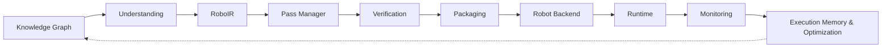
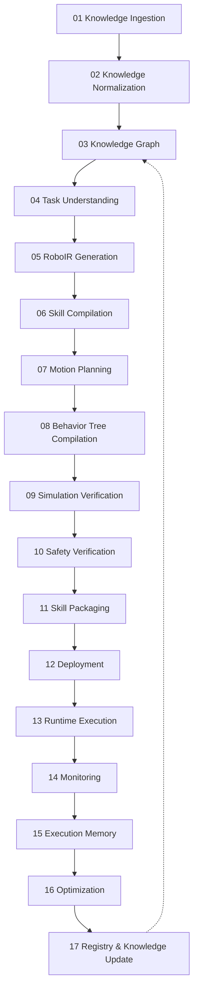

# Architecture

Detailed compiler design: the pipeline, RoboIR's real schema, the Compiler Debugger,
Robot Backends, the knowledge graph, hardware bridges, and the frontend. For the
80/20 overview, start at [`../README.md`](../README.md). For what's real versus
still deferred, cited by file and test, see [`COMPILER_ROADMAP.md`](COMPILER_ROADMAP.md)
and [`REDESIGN.md`](REDESIGN.md).

## System Architecture



RoboIR is the fixed point every later stage reads: the Pass Manager, Verification, and
Packaging never see the raw parsed instruction, only the IR — and run through real,
timed, diagnostic-emitting compiler passes (`ir/pass_manager.py`,
`optimize/pass_manager.py`) rather than a single opaque function call. Robot Backend is
a real, registry-based interface — every backend implemented today happens to target
`rclpy` or URScript, but the interface doesn't assume either. As of the most recent
deepening, the knowledge graph is also a real input to a compiler-adjacent decision
(candidate-robot selection, see "Knowledge Graph & Skill Registry" below), not only a
downstream export.

## Robot Backends, Not "ROS 2 Generation"

```
                              RoboIR
                                 │
                    ┌────────────┴────────────┐
                    │   RobotBackend (real ABC) │
                    │   via a real PluginRegistry│
                    └────────────┬────────────┘
              ┌──────────────────┼──────────────────┐
              ▼                  ▼                  ▼
        Ros2Backend        UrScriptBackend      (register your own)
```

The compiler is data-driven off a declarative `RobotSpec` rather than per-robot code
paths. `plugins/registry.py::PluginRegistry` is a real, generic, name-keyed registry —
the same primitive backs robot-driver bridge dispatch, `RobotBackend`s, and
`DigitalTwin`s. `plugins/backend.py::RobotBackend` (`metadata()`, `capabilities()`,
`validate()`, `compile()`, `deploy()`) has two real implementations: `Ros2Backend`
(wraps the existing ROS 2 codegen) and `UrScriptBackend` (real, syntactically valid
URScript `movej()`/`sleep()`/`set_digital_out()` generated from the compiled skill's
real task graph). `deploy()` runs the real Safety Kernel and a real simulation check
before any bridge connect is attempted. Adding a new backend is a registry entry, not a
compiler change. Full detail: [`REDESIGN.md` §4](REDESIGN.md#4-robot-backends--stop-overfocusing-on-ros-2)
and [`COMPILER_ROADMAP.md`](COMPILER_ROADMAP.md) (v2 Vision, item 3).

**Honest scope note** (in response to external review): backends here perform code
generation for a target middleware/controller dialect, not a full LLVM-style lowering
chain (capability → controller → hardware-abstraction → middleware-abstraction →
codegen as independently staged passes). `RobotBackend.validate()` +
`RobotBackend.compile()` collapse several of those concerns into two real steps today.
Splitting them into independently-inspectable lowering passes is a real, deferred
deepening, not something this doc claims already exists.

## RoboIR

```yaml
skill:
  id: skill_pick_red_cube_v1
intent:
  action: grasp
  object: { type: cube, color: red, role: source }
  destination: { type: bin, color: blue, role: destination }
constraints:
  payload_kg: 2.0
  precision_mm: 1.0
required_capabilities:
  perception: [object_detection, pose_estimation]
  manipulation: [grasp_planning, inverse_kinematics]
capability_claims: # real, per-capability confidence + provenance (v2 item 2)
  - { name: sensing.force_torque, confidence: 1.0, verified: true, source: robot_spec }
execution:
  robot: { dof: 7 }
  planner: { type: damped_pseudoinverse_ik }
verification:
  collision_check: true
  simulation_required: true
```

`required_capabilities` is what makes the Compiler Debugger (below) possible: a skill
that needs a capability the target robot backend doesn't declare fails at compile time
with a structured, fixable error — not a silent bad plan. `capability_claims` carries
real confidence/verified provenance per capability, grounded in the target
`RobotSpec`'s actual declared fields, not a guess. Full schema:
[`REDESIGN.md` §2](REDESIGN.md#2-roboir).

**Honest scope note**: RoboIR today is closer to a typed, capability-annotated *job
description* than an executable computational graph — `task_summary`/`motion_summary`
(v2 item 1) are real but read-only reflections of the task graph, not the graph itself.
The actual per-task/per-motion structure (`TaskGraph`, `MotionPlan`) still lives on
`CompiledSkill`, produced downstream of RoboIR, not encoded inside it. Folding that
structure into RoboIR itself — so RoboIR is the thing optimization passes rewrite,
rather than something optimization passes only read alongside a separate
`CompiledSkill` — is real, deferred architectural work, tracked as an open item rather
than implied to already be done.

## Compiler Debugger

```
Error RW102: Cannot compile skill 'pick_and_place_v1' for backend 'ur5e_backend'.

  Reason:   RoboIR requires sensing.force_torque; the target backend does not
            declare a force/torque sensor.
  Required: sensing.force_torque
  Fixes:    1. Attach and register a force/torque sensor.
            2. Change execution.controller.type to "position".
            3. Select a different robot backend.
```

Compiler-grade diagnostics, not a stack trace — emitted by a real, ordered pass
pipeline (`ir/pass_manager.py` for RoboIR passes, `optimize/pass_manager.py` for
`CompiledSkill` passes) instead of one opaque function call, with real per-pass timing
and metrics and a `roboweaver compile --explain-passes` trace to inspect it. The
diagnostic taxonomy spans RW1xx (capability), RW2xx (perception), RW3xx (safety), RW4xx
(RoboIR structural), RW5xx (`CompiledSkill` structural/timing/BT well-formedness), and
RW6xx (multi-robot choreography DAG). Try it: `roboweaver compile "Tighten the bolt"
--robot temi` raises exactly the RW102 diagnostic above, because Temi is a mobile base
with no force/torque sensor (`has_force_torque_sensor=False`, a real field on its
`RobotSpec`). Perception gaps (no perception system exists yet) surface as
non-blocking `RW201` warnings instead of a silently assumed pose. Rendered live in the
frontend's Compiler view — auto-compiled on open, not an empty console waiting for
input.

**Honest scope note**: today's passes are dominated by verification/diagnostics
(`RoboIRVerificationPass`, `CapabilityPass`, `SafetyPass`,
`CompiledSkillVerificationPass`) plus two real, narrow optimizations
(`WaypointDecimationPass`, `RedundantSegmentElisionPass`). There is no dead-code
elimination, constant propagation, or register-allocation analog yet — those don't
have an obvious 1:1 mapping onto a physical-robot compiler, but the broader class of
"passes that transform the plan to make it measurably better," not just validate or
compress it, is genuinely underrepresented relative to an LLVM-style pipeline. A
motion-fusion pass (merging adjacent redundant motion segments beyond
`RedundantSegmentElisionPass`'s exact-endpoint case) and a task-reordering pass
(nearest-neighbor ordering of independent targets to reduce total joint travel) are
real, bounded candidates for closing that gap, not yet built.

## Complete Pipeline (Research Vision)



More of this is real today than when this table was first written: Knowledge Ingestion
(03) is real registry ingestion, not a demo dataset; Execution Memory (15) and
Optimization (16) are real, tested mechanisms; Monitoring (14) is real
`TelemetryRecorder`. Motion Planning (07) is still a distinct call from `compiler.py`
rather than a pass inside the Pass Manager alongside 06/08 — real IK/trajectory
generation either way, but not yet inspectable via `--explain-passes` the way the
static-analysis and optimization passes are. Full per-stage real-vs-roadmap table, kept
current: [`REDESIGN.md` §3](REDESIGN.md#3-full-stage-table).

## Runtime & Hardware Bridges

`ROS2HardwareBridge` and `SimulationHardwareBridge` genuinely attempt a live `rclpy`
connection or a live TCP reachability probe and truthfully report failure when nothing
answers — verified in `tests/test_universal_platform.py`. The Inspire Hand RS485 driver
implements a real CRC-16/MODBUS checksum and a real serial read/write round trip,
proven against a virtual pty loopback (`tests/test_inspire_hand_real_serial_protocol.py`)
— no physical hand required to verify the protocol. The connection advisor (`roboweaver
advise`) is a real, optional local Ollama call that only ever *suggests* a robot id/protocol — the backend
validates it against the real registry, so a hallucinated id never reaches the UI as a
suggestion. No physical robot or live ROS 2 graph has run against this repository's
test suite — deliberately: faking one to look more credible would be the first real
violation of this project's own "state what's real" discipline, not a strengthening of
it. The honest path to closing that gap is a real, reachable simulator (Gazebo/Webots),
tracked as open work in [`ROADMAP.md`](ROADMAP.md), not simulated here.

## Knowledge Graph & Skill Registry

`RoboticsKnowledgeGraph` is a real, generic, JSON-serializable property graph.
`knowledge/ingest_registry.py::build_graph_from_registry()` builds it from the live
registries, not seeded demo data: one `ROBOT` node per distinct `RobotSpec` in
`ROBOT_REGISTRY` (11), one `PACKAGE` node per `RoboticsPackageNexus.PACKAGE_CATALOG`
entry (11) with real `COMPATIBLE_WITH` edges to the robots its own `compatible_robots`
list actually names, one `SKILL` node per NL-reachable `IndustrialSkillCategory` (17)
with a `SUITABLE_FOR` edge gated on `has_force_torque_sensor` for skills that really
need it — 39 nodes, 213 edges, verified live. `find_path()` is a real BFS returning
`None` (never a fabricated route) when two nodes genuinely aren't connected within the
hop limit. `knowledge/obsidian_export.py::export_to_obsidian()` writes one real
markdown note per node with a properties table and `[[wikilink]]`-cross-linked outgoing
edges — every link resolves to a real file, opens as a connected graph in the actual
Obsidian app. Reachable from the CLI (`roboweaver graph build|path|export-obsidian`),
the dashboard API (`/api/graph`, `/api/graph/path`, `/api/graph/export-obsidian` —
streams the same vault as a one-click zip download), and the frontend (below, a real
d3-force-laid-out graph view, not a static diagram).

**The graph now actually influences a compiler-adjacent decision, not only downstream
export.** `SkillCompiler.classify_category()` exposes the exact real classification
`compile()` itself routes through, robot-independent.
`knowledge/ingest_registry.py::suggest_robots_for_instruction()` uses it to look up the
instruction's real skill node and return every robot id the graph's own `SUITABLE_FOR`
edges connect to it. `optimize/cost_model.py::compare_robots()` calls this when
`robot_ids` is omitted, so "which robots are even candidates" is now a real
graph-derived answer, not something the caller has to already know —
`RobotComparison.candidate_source` reports whether that happened. A real result this
surfaced: for `"Tighten the M8 bolt"` the graph proposes `shadow_hand`/`robotiq_hand`
(they declare force/torque sensing) as candidates, but both genuinely fail to compile
(real IK non-convergence, reported in `skipped`) — the graph narrows on a coarse real
signal, the compiler's simulation-grounded compile step remains the actual authority.
That's the intended shape: the graph informs, it doesn't override verification.

`SkillRepository` persists compiled skills to disk; a fresh instance (simulating a
process restart) correctly reconstructs the full compiled skill via
`SkillPackage.from_dict()` — verified in `tests/test_ir.py`.

## Frontend — Compiler Studio, Not an IDE

An earlier revision of this frontend was a VSCode/Antigravity-style IDE shell —
Activity Bar, Explorer file-tree, multi-tab strip, Terminal drawer. External review
feedback argued that shape undermines the project's own identity: a robotics
*compiler* presented as a generic file-navigation tool. Rebuilt around a pipeline-first
`TopNav` instead: **Compile → Compare → Workcell → Benchmark** render as a connected
sequence (real pipeline-adjacent stages, `components/nav/TopNav.tsx`), with
Robots/Digital Twin/Knowledge Graph/Packages/Connect/Settings as a plain destination
list — a single active view at a time (`useState`, no tab-open state, no new state
library). The cyan/violet/rose visual identity carried over unchanged; what changed is
structure, not palette.

**`components/PipelineTraceView.tsx`** is the new centerpiece on the Compile page:
`/api/compile?explain_passes=1`'s real per-pass `timing_s`/`modified`/`skipped`/
`diagnostics`/`metrics` (already real since Phase 2, previously only shown as a flat
Terminal-panel text feed) rendered as a real horizontal flow — timing bars, real
metric chips (e.g. `WaypointDecimationPass`'s real `waypoints_before=204,
waypoints_after=44, pct_reduction=78.43`), connected by arrows.

**`components/RoboIRDiffView.tsx`** + a new `GET /api/diff?instruction=&robot=&robot2=`
route back the Compare page's real cross-robot RoboIR diff — the godbolt.org-style
"one instruction, compare targets" moment. Deliberately *not* a per-pass diff within a
single compile: `ir/diff.py::diff_trace()`'s own docstring says that comparison shows
"no differences" for almost every real compile today, since the three registered
RoboIR passes are diagnostics-only. The cross-robot comparison
(`ir/diff.py::diff_ir()`, the same real function `roboweaver diff --robot2` already
used) is the substantive one — compiling the same instruction for two robots produces
real `field_changes` (`execution.dof`, `constraints.payload_kg`, ...).

The **Digital Twin view** is real three.js, not a canvas sketch: the Inspire Hand and
TurtleBot 4 meshes are built from each robot's real published `RobotSpec.links`
lengths, with the hand's finger bends driven by real per-actuator telemetry from the
backend `InspireHandSimulator` — same OrbitControls/lighting/auto-fit rig already used
for the Franka arm's real CAD mesh. A working Wireframe toggle is a real three.js
material property, not a dead button.

The **Knowledge Graph view** is a real force-directed layout (`d3-force`) of the same
graph the CLI/API expose — drag any node, search-highlight, click a node for its real
properties, run a real multi-hop "find path" query, or download the whole thing as a
real Obsidian vault `.zip`. Labels are hidden below a zoom/hover/selection threshold —
a 39-node, 213-edge hub-heavy graph (a no-sensor-requirement skill connects to all 11
robots) turned out genuinely illegible with every label always on, an empirically-found
UX fix, not a design guess.

Every view fetches its own data client-side from the dashboard API; an offline backend
is a disclosed state (`Engine offline` in the nav bar), never a silently stale UI.

**Honestly out of scope for this pass** (named, not silently dropped): React Flow/
Cytoscape-based non-linear pipeline visualization (today's pipeline is linear — a
graph library earns its place once motion-planning/scheduling passes exist);
Framer Motion transitions; a Monaco editor for instruction/RoboIR editing; ECharts
benchmark history/dashboards; Zustand/TanStack Query global state (proportionate to
~11 views, each fetching its own data, not yet a real pain point); an Execution
Memory timeline; trajectory replay/velocity/acceleration visualization in the Digital
Twin.
