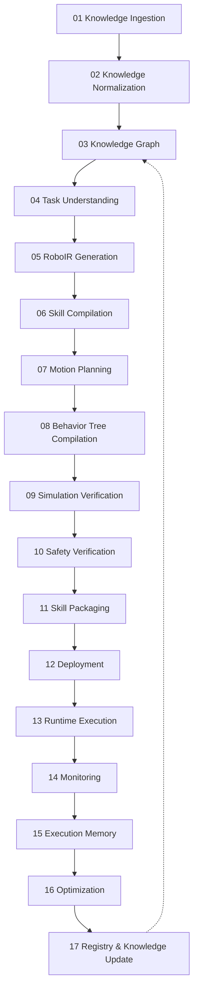

# RoboWeaver — Compiler Infrastructure Redesign (v3)

**Status:** design revision 3, **with Phase 1 of §9 now implemented in the codebase**
(not just designed) — see §11 for exactly what changed, cited by file, and what's still
design-only. Every claim about current behavior cites the actual file. Changes from
revision 2 are called out explicitly in §10 rather than silently merged in, because
pretending a document never had a gap is the same dishonesty this whole redesign exists
to remove from the product itself.

---

## 0. Identity & Positioning

> **RoboWeaver is an LLVM-like compiler infrastructure for robotics that transforms
> human intent and robotics knowledge into verified, executable robot skills.**

```
LLVM:      Source Code  →  LLVM IR              →  Machine Code (x86 / ARM / RISC-V)
RoboWeaver: Human Intent →  RoboIR               →  Robot Skill (Franka / UR / Pepper / …)
            + Knowledge                             via a Robot Backend (§4)
```

Revision 2 stated the identity correctly but left a structural hole that made the
analogy incomplete: **there was no IR.** The pipeline went straight from "Task
Understanding" to "Skill Compilation" — a compiler with a parser and a code generator
but nothing in between is not a compiler, it's a chain of Python functions
that happen to run in order. §2 fixes this: RoboIR is now its own stage, and every
stage from Skill Compilation onward consumes it, never the raw parsed intent directly.

---

## 1. The Pipeline (Full / Research Vision)



Two renames from revision 2, both corrections, not relabeling for its own sake:

- **Stage 02 is "Knowledge Normalization," not "Knowledge Compilation."** Turning a
  PDF, a URDF, or a ROS package's docs into a common ontology is *extraction and
  normalization* — nothing is being compiled yet because nothing executable exists
  yet. "Compilation" is reserved for Stage 06, where an IR turns into an executable
  artifact. Reusing the word for two different transformations was itself the kind of
  imprecision this redesign is supposed to remove.
- **Stage 15/16 are "Execution Memory" and "Optimization," not "Memory & Learning."**
  Storing `(skill, observation, action, result, failure)` tuples is memory. Tuning a
  skill's parameters from that history is optimization. Neither is "the robot learns" —
  that phrase gets used the moment there's a policy that improves without a human in
  the loop, and nothing here does that. Say what's built, not what it sounds like.

---

## 2. RoboIR

The intermediate representation every stage from 06 onward reads or writes. This was
present in revision 1, dropped in revision 2's stage renumbering, and is reinstated
here as its own numbered stage rather than an implicit detail — that's the single
biggest structural fix in this revision.

```yaml
# RoboIR — one compiled skill, before any robot-specific realization
skill:
  id: skill_pick_red_cube_v1
  version: 0.1.0

intent:
  action: grasp
  object:
    type: cube
    color: red
    role: source
  destination:
    type: bin
    color: blue
    role: destination

constraints:
  payload_kg: 2.0
  precision_mm: 1.0

required_capabilities:
  perception: [object_detection, pose_estimation]
  manipulation: [grasp_planning, inverse_kinematics]
  sensing: []                 # e.g. force_torque — populated when a skill needs it

execution:
  robot:
    dof: 7
  planner:
    type: damped_pseudoinverse_ik   # today's real solver; RRTStar/etc. are backend-specific, §4
  controller:
    type: position                  # today's real controller mode; impedance is roadmap

verification:
  collision_check: true
  simulation_required: true
  safety_checks: [reach, floor, payload, joint_limits]
```

`required_capabilities` is new relative to revision 1's schema, and it's not
decorative — it's the field the Compiler Debugger (§6) reads to produce a structured
diagnostic instead of a silent failure or a wrong skill. A skill that needs
`force_torque` sensing, compiled against a robot backend (§4) that doesn't declare that
capability, should fail at Stage 06 with an explicit error, not compile to a BehaviorTree
that quietly can't do what it claims to.

Full pydantic-shaped field list (goal, objects, robots, sensors, actuators,
motion_requirements, safety, recovery, execution/validation/simulation metadata,
dependencies, skill_version) is unchanged from revision 1 — the YAML above is the
readable projection of that schema, not a replacement for it.

**Why this had to be a stage, not a detail:** today's `compiler.py::SkillCompiler.compile()`
goes straight from `SkillIntent` (one action, one object name, a `dict[str, float]` of
parameters) to task decomposition. There's no artifact in between that a motion planner,
a different robot backend, or a debugger could inspect independently. Making RoboIR its
own stage means "show me what the compiler understood before it started planning motion"
becomes a real, inspectable thing — which is also exactly what the Compiler Debugger (§6)
needs to exist at all.

---

## 3. Full Stage Table

| # | Stage | Real today | Gap |
|---|---|---|---|
| 01 | Knowledge Ingestion | `knowledge/ingest.py` — matches `Skill:`/`Tool:`/`Object:` line prefixes only. | Real document ingestion needs an LLM extractor. |
| 02 | Knowledge Normalization | `knowledge/ontology.py` typed node/edge conversion. Real, small, correct. | — |
| 03 | Knowledge Graph | `knowledge/graph.py::RoboticsKnowledgeGraph` (real, generic) + the 11-package ROS 2 catalog (real, keyword-matched, not retrieval). | Seed data is a demo, not a comprehensive ontology. |
| 04 | Task Understanding | `compiler.py::_parse_intent` + `fleet/prompt_builder.py::SystemPromptParser` — deterministic regex. **Compound-goal splitting fixed** (§11): "pick the red cube and place it into the blue bin" now parses source/destination as separate objects, tested in `tests/test_ir.py`. | Still two separate parsers (single-skill vs. multi-robot); unifying them is unstarted. |
| **05** | **RoboIR Generation** | **Real, implemented** (§11): `ir/schema.py` (RoboIR dataclasses), `ir/builder.py` (`build_ir()`), `ir/diagnostics.py` (the Compiler Debugger). `compiler.py::SkillCompiler.compile_with_diagnostics()` is the Stage 04→05→06 entrypoint. Tested in `tests/test_ir.py`, exposed via `/api/compile`'s `ir`/`diagnostics` fields, and rendered in the frontend's Compiler view. | Schema covers objects/constraints/capabilities/execution/verification; safety/recovery/versioning metadata from the original design (revision 1) aren't populated yet. |
| 06 | Skill Compilation | `compiler.py::SkillCompiler` — real, tested, now consumes/produces RoboIR via `compile_with_diagnostics()`. Still mixes four stages' responsibilities into one class's private methods. | Split per stage (still one class, just no longer IR-less). |
| 07 | Motion Planning | `hardware/kinematics_ndof.py::NDOFIKSolver` — real N-DOF damped pseudoinverse, tested. `planner.py` **deleted** (§11) — confirmed zero imports before removal. | Position-only IK, no orientation target. |
| 08 | Behavior Tree Compilation | `codegen/groot2.py` — real, tested. | — |
| 09 | Simulation Verification | `runtime/engine.py::SkillRuntime` — real native + optional MuJoCo. | No pass/fail gate blocking Stage 11 yet. |
| 10 | Safety Verification | `hardware/safety_guard.py::WorkspaceSafetyGuard` — real geometric checks. Not ISO 10218/15066 certified — never say otherwise. **Compiler Debugger's `sensing.force_torque` check (§11) is a new, separate capability-declaration gate**, distinct from this stage's geometric checks. | — |
| 11 | Skill Packaging | `registry/package.py::SkillPackage` (`.rwsp` export) + real `rclpy` ROS 2 codegen. **`json.dump_str` dead branch removed; `to_dict()`/`from_dict()` now round-trip the full compiled skill** (§11). | Generated packages never `colcon`-build-checked in CI. |
| 12 | Deployment | **Not implemented** — today's "deployment" is a local JSON write. | Entire stage is roadmap. |
| 13 | Runtime Execution | `hardware/universal_driver.py` bridges genuinely attempt live `rclpy`/TCP connections and honestly report failure. RS485 driver: real CRC-16/MODBUS, proven via pty loopback. | Never run against live hardware/ROS 2/Isaac/Gazebo. |
| 14 | Monitoring | **Fixed (§11).** `runtime/telemetry.py::TelemetryRecorder` and `runtime/recovery.py::RecoveryEngine` are now genuinely called by `SkillRuntime.execute()` — real telemetry frames recorded per simulation step, real recovery diagnosis on grasp failure and joint-limit violation, both surfaced on `ExecutionResult`. Tested in `tests/test_ir.py`. | Recovery plans are diagnosed but not yet automatically acted on (no auto-retry loop). |
| 15 | Execution Memory | **Does not exist.** `ExecutionResult` (now telemetry/recovery-enriched, §11) is still discarded after being returned to the caller — nothing persists it. | Entire stage is roadmap. |
| 16 | Optimization | **Does not exist.** No mechanism reads Stage 15's history and revises a skill. | Depends on 15 existing first. Never call this "learning" or "intelligence" (§1). |
| 17 | Registry & Knowledge Update | **Reload bug fixed (§11).** `registry/repository.py::SkillRepository._load_all()` now reconstructs the full compiled skill via `SkillPackage.from_dict()` instead of discarding it (`skill=None`) — verified in `tests/test_ir.py` by simulating a process restart. | No feedback loop into Stage 03 yet. |

---

## 4. Robot Backends — Stop Overfocusing on ROS 2

Revision 2 led with "generates complete ROS 2 packages" as the headline capability.
That invites the wrong question — *"why not just use MoveIt?"* — because it frames
ROS 2 generation as the product instead of as one target of it.

```
                              RoboIR
                                 │
                    ┌────────────┴────────────┐
                    │    Robot Backend Layer    │
                    └────────────┬────────────┘
              ┌──────────────────┼──────────────────┐
              ▼                  ▼                  ▼
       Franka Backend      UR Backend         Pepper Backend
       (ROS 2 / rclpy)     (ROS 2 / rclpy)    (ROS 2 / rclpy)
```

**What's honest about today's code:** there isn't literally a `FrankaBackend` class
distinct from a `URBackend` class, and that's *correct*, not a gap — `compiler.py` and
`codegen/ros2_gen.py` are already data-driven off `RobotSpec` (`hardware/robot_spec.py`),
so one generic compiler targets every registered robot without embodiment-specific code
paths. The redesign here is to make that implicit backend abstraction an explicit
interface (`RobotBackend.compile_motion(ir)`, `RobotBackend.package(ir)`), specifically
so a backend that *isn't* ROS 2 — a proprietary SDK, a non-ROS controller, a different
simulator's native API — can be added later without touching Stages 05–10. Every
backend implemented today happens to target `rclpy`; that's an implementation fact
about the current backends, not a ceiling on the architecture.

---

## 5. Multi-Robot Choreography Moves to Phase 3

`fleet/choreographer.py::MultiRobotChoreographer` is real, tested, working code — DAG
scheduling and Groot2 composite BehaviorTree synthesis across heterogeneous
embodiments. It is not being deleted or devalued. It's being **repositioned**: it stops
being part of the core pipeline story and becomes what it actually is — a genuinely
working extension built on top of the single-robot pipeline, demoted to Phase 3 of the
roadmap (§9) rather than leading the identity.

The reason is credibility, not capability: a reviewer who sees "compiles one skill for
one robot, verified in simulation, packaged, done" trusts that the core works. A
reviewer whose first impression is multi-robot workcell choreography reads it as "this
project is trying to solve all of robotics" before they've seen the compiler prove
itself on the simplest case. Prove Stage 01→11 on one robot first; multi-robot is what
you show *after* that's credible, not instead of it.

---

## 6. Compiler Debugger — Structured Diagnostics

New feature, proposed here for the first time (not present in revisions 1–2). The
value case: a compiler with an IR (§2) can produce compiler-grade error messages
instead of a stack trace or a silently wrong skill.

```
Error RW102: Cannot compile skill 'pick_and_place_v1' for backend 'ur5e_backend'.

  Reason:
    RoboIR requires capability `sensing.force_torque` (impedance controller
    requested in execution.controller.type), but the target robot backend does
    not declare a force/torque sensor.

  Required capability:
    sensing.force_torque

  Possible fixes:
    1. Attach a force/torque sensor and register it on the robot's RobotSpec.
    2. Change execution.controller.type to "position" (vision-only grasp).
    3. Select a different robot backend that declares force_torque sensing.
```

Mechanically: Stage 06 (Skill Compilation) diffs a RoboIR's `required_capabilities`
against the target `RobotSpec`'s declared capabilities before planning motion, and
raises a typed `CompilerDiagnostic` (error code, reason, missing capability, suggested
fixes) instead of either crashing uninformatively or silently compiling a skill the
robot can't actually execute. This is genuinely new work — no error-code system exists
in the codebase today — and it's cheap to build precisely because RoboIR (§2) now
exists as the artifact to validate against. Surfaced in the frontend (§7) as a first-class
result state, not just an HTTP 500.

---

## 7. Frontend — The Front Door Is "Create Skill," Not a Nav Menu

Revision 2 specified the pipeline-dashboard view (kept, §7 of that revision, unchanged)
but buried it behind navigation. The homepage should be the demo:

```
┌───────────────────────────────────────────────────┐
│  Create a skill                                    │
│  ┌─────────────────────────────────────────────┐   │
│  │ Pick the red cube and place it in the box    │   │
│  └─────────────────────────────────────────────┘   │
│                                    [ Compile ]      │
└───────────────────────────────────────────────────┘

         ✓ Knowledge          ✓ Task Understanding
         ✓ RoboIR             ✓ Motion Planning
         ✓ Behavior Tree      ● Simulation …running
           Safety               Package

  ─────────────────────────────────────────────────
  Skill generated successfully
  → download robot_skill.rwsp
  → view generated ROS 2 package
```

One input, one run, one artifact out. This is the "wow moment" — everything else
(Knowledge browser, Fleet Registry, Execution history) is a secondary workspace for
after someone has seen this work once, not competing with it for the first screen.

---

## 8. MVP — What Actually Gets Built in 3–4 Weeks

Sixteen or seventeen stages is the research-vision architecture (§1), not the build
plan. The build plan is nine stages, and the reason feasibility is higher than it looks
is that **eight of the nine already have real, tested code** — the work is mostly
wiring and one genuinely new stage, not sixteen new subsystems:

| MVP Stage | Maps to | Status |
|---|---|---|
| 01 Knowledge | `knowledge/graph.py`, `knowledge/package_nexus.py` | Real |
| 02 Task Understanding | `compiler.py::_parse_intent` | Real; compound-goal fix **done** (§11) |
| 03 **RoboIR** | `ir/schema.py`, `ir/builder.py`, `ir/diagnostics.py` | **Done** (§11) — dataclasses (not pydantic, to match the existing codebase's convention and add zero new dependencies), tested in `tests/test_ir.py` |
| 04 Skill Compiler | `compiler.py::SkillCompiler.compile_with_diagnostics()` | Real, **now consumes/produces RoboIR** (§11) |
| 05 Motion Planner | `hardware/kinematics_ndof.py::NDOFIKSolver` | Real |
| 06 Behavior Tree | `codegen/groot2.py` | Real |
| 07 Simulation | `runtime/engine.py::SkillRuntime` | Real; `TelemetryRecorder`/`RecoveryEngine` **wired in** (§11) |
| 08 Package | `registry/package.py::SkillPackage` | Real; dead `json.dump_str` branch removed, full round-trip serialization added (§11) |
| 09 Dashboard | `frontend/src/components/CompilerView.tsx` | **Done** (§11) — RoboIR + Compiler Debugger diagnostics rendered live from `/api/compile` |

**Demo for the 3–4 week milestone:**
`"Pick the red cube and place it in the box"` → RoboIR → Behavior Tree → Trajectory →
MuJoCo simulation → `.rwsp` skill package. Everything past Stage 09 (Deployment through
Registry & Knowledge Update) and multi-robot choreography (§5) are explicitly Phase 2/3,
not MVP scope.

---

## 9. Roadmap

**Phase 1 — MVP (§8): done.** See §11 for exactly what was built, cited by file, and
what's still open within Phase 1 (the API is still synchronous `http.server`, not
FastAPI; the frontend is one flow, not yet the full pipeline-dashboard view from §7).

**Phase 2 — Deployment & Runtime:** job/event model, async API, `colcon`-build CI
check for generated packages, real Stage 12 deployment beyond a local file write.

**Phase 3 — Multi-Robot Backend:** re-promote `MultiRobotChoreographer` (§5) from
"working extension" to a documented, demoed capability once the single-robot pipeline
has proven itself.

**Phase 4 — Memory & Optimization:** Stage 15 (execution-log persistence) before Stage
16 (parameter tuning from that history) — never the reverse, and never described as
learning until it demonstrably is.

**Explicit non-goals, unchanged:** multi-tenant auth, a skill marketplace, mobile
clients, Kafka/Kubernetes/Neo4j until a measured need exists.

---

## 10. Backend Stack (MVP-Scoped)

Revision 1 already ruled out Kafka/Kubernetes/Redis/Neo4j for lack of justification.
This revision scopes the *positive* MVP stack tighter than revision 2's FastAPI +
PostgreSQL-only recommendation:

| Layer | MVP choice | Why not the heavier option yet |
|---|---|---|
| API | FastAPI | Unchanged from revision 1/2 — typed, replaces the hand-rolled `http.server` handler. |
| Job/skill state | SQLite | A single-process MVP doesn't need Postgres's concurrency guarantees yet; the schema (jobs, skill packages, execution logs) is small and migrates to Postgres unchanged once concurrent multi-instance access is a real requirement, not a hypothetical one. |
| Knowledge retrieval | Local vector store (e.g. `sqlite-vec`, or an embedded Chroma instance) — **optional at MVP**, wired in when Stage 02/03 or an LLM-backed Task Understanding backend needs semantic package/skill matching. The current 11-package catalog is small enough that keyword matching (today's real behavior) is sufficient without one. | Premature before there's a retrieval workload to serve. |
| Artifacts | Local filesystem | `.rwsp` archives, BT XML, logs — no object storage needed until deployment targets something other than a developer's machine. |

Graduation triggers, stated up front instead of decided ad hoc later: SQLite → Postgres
when a second API instance needs to see the same job state; local files → object
storage when Stage 12 (Deployment) targets a fleet instead of a laptop.

**Not yet done:** this section is still the design target, not the current backend.
`dashboard/server.py` is still the stdlib `http.server` handler (now API-only — its
embedded HTML dashboard was deleted, §11) — no FastAPI, no SQLite, no vector store yet.

---

## 11. What Actually Got Built (Phase 1)

Every item below is real, tested code as of this revision — not a plan. Cited by file
so this section stays checkable the same way the audit in §1 was.

- **RoboIR (Stage 05), real.** `src/roboweaver/ir/schema.py` (dataclasses — not
  pydantic; the existing codebase's convention is stdlib `@dataclass` everywhere, and
  matching it added RoboIR with zero new dependencies), `ir/builder.py::build_ir()`,
  `ir/diagnostics.py` (the Compiler Debugger). `compiler.py::SkillCompiler` gained
  `compile_with_diagnostics()` as the Stage 04→05→06 entrypoint, returning a
  `CompilationResult(skill, ir, diagnostics)` — additive; the original `compile()`
  is untouched, so every existing caller (CLI, retargeter, fleet build) is unaffected.
- **Compiler Debugger, real, not a mockup.** `ir/diagnostics.py::check_required_capabilities()`
  diffs a RoboIR's `required_capabilities` against the target `RobotSpec`. Two real
  robots (`temi`, `turtlebot4`) were given `has_force_torque_sensor=False` — an honest
  correction, not a demo fixture, since both are mobile bases with no manipulator force
  sensing — so compiling a `TIGHTEN` skill against either now genuinely raises
  `SkillCompilationError` with a structured `RW102` diagnostic (message, reason,
  required capability, numbered fixes). Perception capability gaps surface as
  non-blocking `RW201` warnings on every pick/place skill, since no perception system
  exists anywhere in RoboWeaver — an honest signal, not a suppressed one.
- **The exact compound-goal bug from §2, fixed.** `compiler.py::_parse_intent` now
  matches a `pick X and place it (in|into|on) Y` clause before the plain-pick regex,
  producing `Action.PLACE` with a `destination_object` parameter; `ir/builder.py`
  turns that into two `ObjectRef`s (`role="source"`, `role="destination"`) instead of
  one malformed token. Regression-tested in `tests/test_ir.py` against the literal
  sentence this document uses as its running example.
- **`TelemetryRecorder`/`RecoveryEngine`, wired into `SkillRuntime.execute()`.** No
  longer orphaned modules exercised only by their own unit tests (§1's headline
  example) — `_step()` now calls `self.telemetry.record(...)` every simulation step,
  and `execute()` calls `self.recovery.diagnose(...)` on a failed grasp or a joint-limit
  violation. `ExecutionResult` gained `telemetry_frame_count` and `recovery_events`
  fields (backward-compatible defaults) so this is observable, not just internal.
- **The skill-registry reload bug, fixed.** `registry/package.py::SkillPackage.to_dict()`
  now serializes the full compiled skill (motion plan, behavior tree — recursively for
  `BTNode`), and a new `SkillPackage.from_dict()` reconstructs it.
  `SkillRepository._load_all()` uses it instead of building a metadata-only shell with
  `skill=None`. Verified in `tests/test_ir.py` by registering a package, constructing a
  *fresh* `SkillRepository` instance (simulating a process restart), and asserting the
  reloaded skill's motion plan and behavior tree match the original.
- **Dead code removed.** `planner.py` deleted (confirmed zero imports first). The
  `json.dump_str` dead branch in `registry/package.py` (§1) replaced with a single
  `json.dumps` call. The embedded HTML dashboard in `dashboard/server.py`
  (`get_dashboard_html()`, `_send_html()`) deleted — the API server's `/` route now
  returns a short JSON pointer to the real frontend instead of serving a second,
  undeveloped UI.
- **API surface extended, not replaced.** `/api/compile` gained a `robot` query
  parameter and now returns `ir` and `diagnostics` alongside the existing
  `intent`/`tasks`/`behavior_tree_xml` fields; a capability violation returns HTTP 400
  with the blocking diagnostics as the body instead of a stack trace or a silent 500.
- **Frontend: a real Compiler workspace**, not a mockup — `frontend/src/components/CompilerView.tsx`,
  wired to the extended `/api/compile`. Renders RoboIR (objects with role and
  `pose_source` badges, required capabilities, execution/verification), the Compiler
  Debugger's diagnostics (color-coded by severity, with fixes), the task graph, and the
  BehaviorTree XML. Both the success path and the blocking-error path (RW102 against
  `temi`) were driven in a real headless browser during this work, not just unit-tested.
- **Test coverage.** `tests/test_ir.py` — 7 tests covering all of the above, added to
  `.github/workflows/ci.yml`. Full suite (8 files) verified passing in a from-scratch
  `python3 -m venv` + `pip install -e .`, matching exactly what CI runs — not just the
  developer's already-populated environment.

**Still open within Phase 1** (i.e., not silently claimed done): the two Task
Understanding parsers (single-skill vs. multi-robot) are still separate; `SkillCompiler`
still mixes multiple stages' responsibilities in one class; the Simulation Verification
stage still has no pass/fail gate blocking Packaging; the frontend Compiler view is one
flow, not yet the full GitHub-Actions-style pipeline dashboard from §7.

---

## Decision Log — What Changed and Why (Revision 2 → 3)

| Change | Why |
|---|---|
| RoboIR reinstated as Stage 05 | Revision 2's renumbering silently dropped it. A compiler pipeline without an IR between understanding and compilation isn't a compiler — it's a function chain. This was the single most important correction in this round of feedback. |
| "Knowledge Compilation" → "Knowledge Normalization" | Extraction into a common ontology isn't compilation; reusing that word for two different transformations blurred the one place "compilation" should mean something specific (Stage 06). |
| Robot Backend abstraction added (§4) | ROS 2 codegen was reading as the headline capability, which invites "why not MoveIt?" instead of showing the actual differentiator: an embodiment-independent IR realized per backend. |
| Multi-robot demoted to Phase 3 (§5) | Real, working code — kept entirely — but leading with it before the single-robot core is proven undermines credibility rather than building it. |
| "Memory & Learning" → "Execution Memory" / "Optimization" | Neither stage exists yet; naming them with a word ("learning") that implies more capability than parameter tuning from logged history would repeat the exact overclaiming problem this whole redesign exists to fix. |
| MVP stage table added (§8) | Sixteen/seventeen stages is the research-vision ceiling, not a build plan. Naming exactly nine stages, and showing eight of them already have real code, is what actually makes a 3–4 week estimate defensible instead of aspirational. |
| Compiler Debugger added (§6) | A genuinely new differentiator that only became buildable once RoboIR (§2) exists as a validatable artifact — sequenced here right after the IR that makes it possible, not before. |
| Frontend homepage rewritten as one flow (§7) | The pipeline-dashboard view from revision 2 was correct but buried; the demo has to be the first thing anyone sees, not a click away. |
| Tech stack narrowed to SQLite + optional local vector store (§10) | Revision 2 already avoided Kafka/Kubernetes; this goes further and states explicit graduation triggers for Postgres and object storage instead of adopting them speculatively at MVP scope. |
